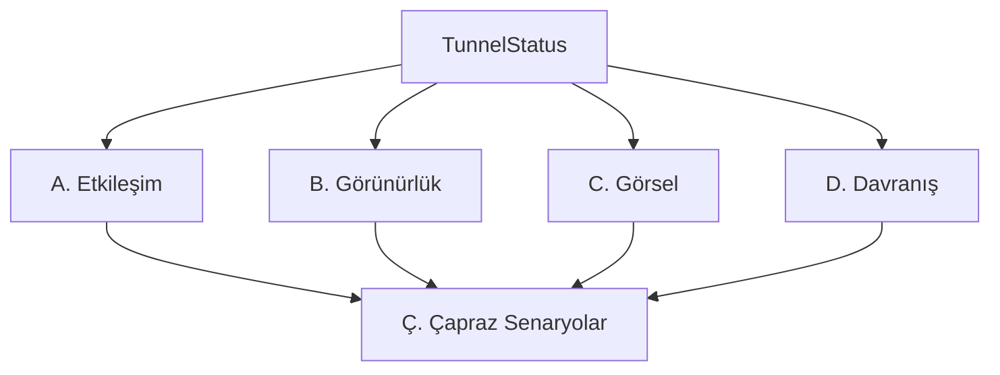

# PhantomUIEngine — Test Akış Diyagramları

> Connection detaylarına bağımlı olmadan, yalnızca TunnelStatus enum değerleri ile UI kurallarını doğrular.

---

## Genel Akış

---

## A. Etkileşim Kuralları / Interaction Rules

- **A1 — canEditConfig**
  - `inactive` → ENABLED (config düzenlenebilir)
  - `active | activating | deactivating | waiting | reasserting | restarting` → DISABLED

- **A2 — canDeleteTunnel**
  - `inactive` → ENABLED (tunnel silinebilir)
  - `active | activating | deactivating | waiting | reasserting | restarting` → DISABLED

- **A3/A4/A5 — canModifyTunnelList**
  - Tüm tunnel'lar `inactive` → ENABLED (import, swipe-delete açık)
  - Herhangi biri `inactive` dışında → DISABLED (tüm liste kilitli)
  - Boş liste → ENABLED

- **A6 — canSubmitImport**
  - Text dolu → ENABLED (import butonu aktif)
  - Text boş / whitespace → DISABLED

---

## B. Görünürlük Kuralları / Visibility Rules

- **B1 — shouldShowStats**
  - `inactive` → HIDDEN (stats section gizli)
  - `active | activating | deactivating | waiting | reasserting | restarting` → VISIBLE

- **B2 — shouldShowActivationError**
  - `error == nil` → HIDDEN (hata metni gizli)
  - `error != nil` → VISIBLE (kırmızı hata metni görünür)

---

## C. Görsel Kuralları / Appearance Rules

- **C1 — statusColor**
  - `active` → green
  - `activating | waiting | reasserting | restarting | deactivating` → orange
  - `inactive` → secondary

- **C2 — statusIcon**
  - `active` → `shield.checkered`
  - `activating | waiting | reasserting | restarting` → `arrow.triangle.2.circlepath`
  - `deactivating` → `arrow.down.circle`
  - `inactive` → `shield.slash`

- **C3 — fieldForegroundStyle**
  - `inactive` → primary (editable görünüm)
  - diğer → secondary (disabled görünüm)

- **C4 — logTagColor**
  - `WS` → orange
  - `WG` → green
  - `TUN` → blue
  - diğer → secondary

---

## D. Davranış Kuralları / Behavior Rules

- **D1 — shouldAutoSave**
  - `inactive` + değişiklik var → SAVE (otomatik kaydet)
  - `inactive` + değişiklik yok → SKIP
  - diğer status + değişiklik var → SKIP (aktifken kaydetme)

- **D5 — isToggleOn**
  - `active | activating | waiting | reasserting | restarting` → ON
  - `inactive | deactivating` → OFF

---

## Ç. Çapraz Senaryolar / Cross-Scenario Tests

- **Senaryo B — Tunnel aktif (`.active`)**
  - edit → DISABLED
  - delete → DISABLED
  - stats → VISIBLE
  - toggle → ON
  - auto-save → SKIP
  - field style → secondary

- **Senaryo C — Tunnel inaktif (`.inactive`)**
  - edit → ENABLED
  - delete → ENABLED
  - stats → HIDDEN
  - toggle → OFF
  - auto-save → SAVE
  - field style → primary

- **Senaryo D — Tunnel beklemede (`.waiting`)**
  - edit → DISABLED
  - delete → DISABLED
  - toggle → ON
  - stats → VISIBLE
  - liste (mixed: active + waiting) → DISABLED
