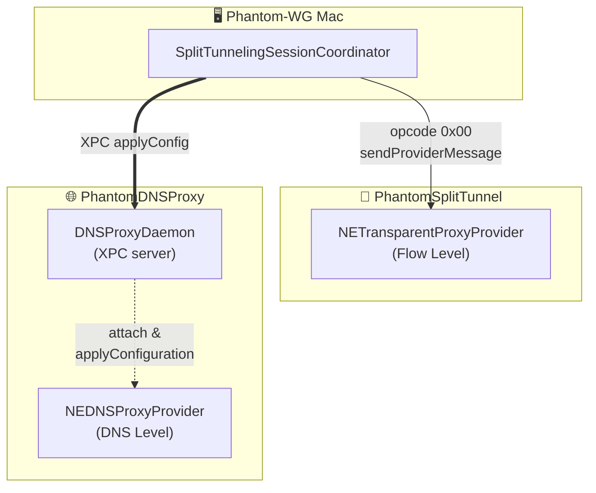
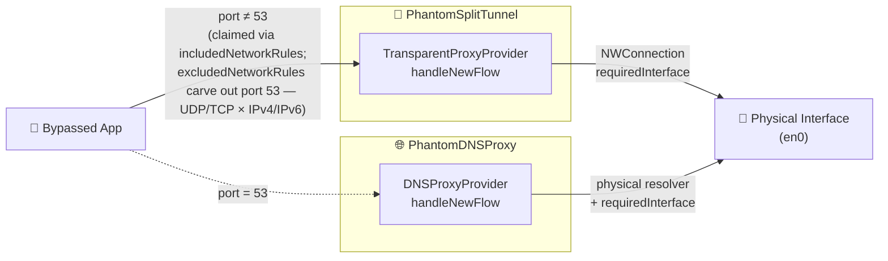

# ADR-0003 — Split-Tunneling and DNS-Proxy Architecture

## Status

Accepted — 2026-05-09

## Context

The Split-Tunneling feature in Phantom-WG Mac sends the traffic of user-selected applications out through a physical interface (e.g. the user's local network). The remaining applications continue to flow through the VPN tunnel. To meet this, Split-Tunneling relies on two asymmetric, independent yet complementary system extensions: `PhantomSplitTunnel` and `PhantomDNSProxy`.

A mandatory architectural decision sits at the heart of why these two extensions work together. `PhantomSplitTunnel` is good at handling packets at the flow level; it guarantees that the application's internet traffic exits through the selected network interface. But even when the application runs under that guarantee, DNS queries still tend to leave through the resolvers provided by the tunnel. This brings concrete problems. If the DNS servers declared on the VPN tunnel side are reachable only through the VPN tunnel, application flows that rely on those resolvers become unreachable. The result is that tunnel-side DNS resolvers end up being queried over the physical interface, and the connection turns into a query against an unreachable endpoint. If those DNS servers are publicly reachable, the queries are still processed through the tunnel-side resolvers. Either case breaks the user-facing `Split-Tunneling` guarantee. In its simplest form, that guarantee says: the selected application's internet traffic exits through the selected network interface, and its DNS queries flow through the resolvers configured on that interface.

macOS offers two distinct NetworkExtension provider types that together solve this problem: `NETransparentProxyProvider` operates at the connection-level flow tier, and `NEDNSProxyProvider` operates at the DNS-resolution layer while preserving the original application's identity. Apple's framework architecture does not allow a single bundle to register two providers. Each system extension declares one provider type. The solution requires **two cooperating system extensions** plus a single party to coordinate them at runtime without choking either side. That role goes to the host app; it is already the only process with access to `NETunnelProviderManager` / `NEDNSProxyManager`.



The two system extensions **share no runtime IPC channel**. Each extension works independently within its own jurisdiction, and coordination always passes through the host app. The two control channels run in parallel — the host app sends `sendProviderMessage` with opcode `0x00` to SplitTunnel and `applyConfig` over XPC to DNSProxy.

For this layout to work in the data path there is one constraint. When `NETransparentProxyProvider`'s `includedNetworkRules` covers port 53 traffic, the Transparent Proxy claims the flow without the DNS Proxy ever seeing it. (Apple DTS engineer Matt Eaton confirmed this on the developer forums: when the rules of two providers overlap, the transparent proxy wins.)

The only way for DNS to remain in `NEDNSProxyProvider`'s jurisdiction is for `NETransparentProxyProvider` to exclude port 53 explicitly via `excludedNetworkRules`. Once this carve-out is in place, the two system extensions no longer need to coordinate in the data path; traffic splits into two parallel lanes as shown below:



This is how the two halves of the asymmetric-routing problem reconverge on a single physical interface: the data half is pinned via `NWConnection.requiredInterface`.

## Decision

Split-Tunneling is run through two stateless system extensions coordinated by the host app. Configuration flows from the host app down to the extensions. The data path is fully separated at the network-rule level via the carve-out.

1. **Two independent extensions, no inter-extension communication.** `PhantomSplitTunnel` (`NETransparentProxyProvider`) pins listed apps' non-DNS flows to the user's chosen physical interface. `PhantomDNSProxy` (`NEDNSProxyProvider`) routes listed apps' DNS flows to the same interface's configured resolver. The two extensions never speak to each other at runtime; each receives its own configuration through its own dedicated channel and operates independently.

2. **Carve-out at the network-rule level.** `PhantomSplitTunnel` builds dual-stack wildcard `includedNetworkRules` to claim all non-DNS traffic, alongside a four-item `excludedNetworkRules` set that explicitly exempts port 53.

   The carve-out is the spine of the architecture. In Apple's framework, when a *Transparent Proxy* and a *DNS Proxy* both claim the same flow, the *Transparent Proxy* wins. Without the carve-out, the *DNS Proxy* would never see a flow. Excluding port 53 literally is the only mechanism by which the DNS lane can move into its own path.

   The dual-stack pair (`0.0.0.0` + `::`) is required because Apple's `NWHostEndpoint` API takes a literal hostname. A single `0.0.0.0/0` rule matches IPv4 only; therefore all four rules — UDP and TCP × IPv4 and IPv6 — must be written explicitly.

3. **The host app is the orchestrator.** `SplitTunnelingSessionCoordinator` owns the runtime lifecycle. There are four lifecycle phases: start (`start(with:)`), stop (`stop()`), reconfigure (`reconfigure(with:)`), and boot coherence (`boot(with:)`).

   **Start (`start(with:)`)**

   - Both extensions are registered through their respective `NEManager` shells.
   - The SplitTunnel session is opened via `startVPNTunnel`.
   - DNSProxy at this point is "registered but lazy".
   - The OS spawns the DNSProxy provider only on the first DNS flow that passes through the carve-out.

   **Stop (`stop()`)**
   - SplitTunnel is disabled first; the carve-out is gone before DNSProxy unwinds.
   - DNSProxy is then disabled.

   **Reconfigure (`reconfigure(with:)`)** — triggered when the user adds, removes, or changes an entry in the list.

   - The new payload is pushed to SplitTunnel via `sendProviderMessage` with opcode `0x00`.
   - The same payload is pushed to DNSProxy via `applyConfig(_:)` over XPC.
   - The persisted `providerConfiguration` is also updated; future bootstraps see the latest blob.

   **Boot coherence (`boot(with:)`)** runs once after the gate clears. Instead of trusting the persisted `config.isEnabled`, the coordinator reads live session state from `SplitTunnelProviderManager` and adopts it as the initial state. The persisted value comes into play only when no live session is found. This is what keeps the UI mirroring what the extensions are actually doing across app close/reopen and system reboots.

4. **Host app ↔ DNSProxy XPC daemon.** The DNSProxy extension hosts an in-process `NSXPCListener` (`DNSProxyDaemon`) under an App-Group-prefixed Mach service name (`group.com.remrearas.phantom-wg-macos.dnsproxy`). This Mach name lets it cross the user-namespace ↔ system-namespace bootstrap boundary that a bare `NSXPCListener.resume()` cannot.

   The host app's `DNSProxyDaemonClient` uses this channel for three RPCs: `applyConfig` (live configuration push), `fetchLogs` (log polling for the sheet's DNS-Proxy tab), and `clearLogs` (manual flush).

   The Mach service name must literally start with one of the binary's `application-groups` entitlement entries. `sysextd` validates this prefix during activation; profile wildcards are not enough.

5. **Lazy-spawn race protection.** `NEDNSProxyProvider` is lazy: the provider class is instantiated only when the first DNS flow lands. The XPC daemon, however, is alive from the very first line of the extension's `main.swift`. When the host app pushes configuration before the provider has come up, the daemon stores the payload in a `pendingConfig` buffer and replies success to the client; later, when the provider attaches via `attach(provider:)`, the buffer is drained and applied. The buffer is overwritten on apply, on detach, and on any subsequent push.

   ```mermaid
   sequenceDiagram
       App->>Daemon: applyConfig (XPC)
       Daemon->>Daemon: provider == nil → buffer pendingConfig
       Daemon-->>App: reply(true)
       Note over Daemon: ...later, on first DNS flow...
       OS->>Provider: startProxy
       Provider->>Daemon: attach(provider:)
       Daemon->>Provider: applyConfiguration(pendingConfig)
   ```

6. **Strict mode at the flow level.** When a flow from a bypassed app arrives and the user's chosen physical interface is unreachable (cable unplugged, Wi-Fi gone, the explicit interface no longer in `availableInterfaces`), the relevant provider rejects the flow with `POSIX EHOSTUNREACH` rather than dropping it onto the OS default route. This way, bypassed apps that cannot leave through the physical path do not silently leak through the tunnel.

   When the bound interface goes away, active relays are torn down via `forceCloseActiveRelays` so we don't sit on `NWConnection`'s `.waiting` state waiting for a timeout. The user sees the apps fail; an `InterfaceUnavailableBanner` surfaces the situation and offers `Switch to Auto` / `Disable Feature` recovery paths.

7. **Shared extension domain.** Code that both extensions need lives in a dedicated directory, shared by both targets through the source list. The layout is three-tiered:

   - **`Extensions/Domain/`** — code shared by both system-extension targets (`InterfaceMonitor`, `RingBufferLogger`, `FlowDecisionEngine`).
   - **`Phantom-WG-MacOS/Domain/`** — only the types that actually cross the host-app ↔ extension boundary (`SplitTunnelingConfiguration`, `DNSProxyDaemonProtocol`, `SharedConstants`).
   - **Extension-local** — types used by only one extension live under that extension's own directory (e.g. `PhantomDNSProxy/Infrastructure/InterfaceDNSResolver`).

   This layout keeps the host-app domain free of code the host process never runs. The cross-cutting boundary becomes visible through directory layout alone.

   ```text
   Phantom-WG-MacOS/        # host app
     Domain/                # boundary-crossing types only
   Extensions/
     Domain/                # code shared by both extensions
   PhantomSplitTunnel/      # extension-local
   PhantomDNSProxy/         # extension-local
   ```

8. **The system DNS resolver toggle uses list membership.** The user can choose to route `mDNSResponder`'s DNS queries through the DNSProxy by enabling the "System DNS Resolver" toggle in the sheet. The toggle has no separately persisted boolean. Its state is whether the synthetic `com.apple.mDNSResponder` and `com.apple.mDNSResponderHelper` entries exist in `configuration.apps`. This is the ***single source of truth*** principle applied at the data-model layer; there can never be a moment when the toggle position and the actually-configured app list disagree.

## Consequences

- **DNS leak is closed in normal operation.** While both extensions are running, every DNS query from a listed app — whether through mDNSResponder or directly — is intercepted by DNSProxy and pinned to the physical interface's resolver. The app's subsequent data flow is intercepted by SplitTunnel and pinned to the same interface. No asymmetric routing: both halves go out physically.
- **Two consent dialogs, not one.** Splitting into two extensions doubles the user's first-time setup friction at the system-extension layer. We absorb this through the `Extension Gate` mechanism (ADR-0002) and accept it as a fixed cost of the architecture.
- **Extensions are independent and logic stays local.** Neither extension watches or coordinates with the other. Each is a stateless worker that reads its config and processes its own lane. The single coordinator is the host app, and it does not peek inside extensions — it pushes configuration, reads logs. Maintenance is an extension-local concern; debugging follows the data flow rather than a state machine that spans processes.

## Future Work

For users who want a strict kill-switch that fully prevents bypassed app traffic from touching the tunnel envelope, an extension based on `NEFilterDataProvider` (`PhantomMonitor`) is being scoped. The strict kill-switch design will be documented in its own ADR.
