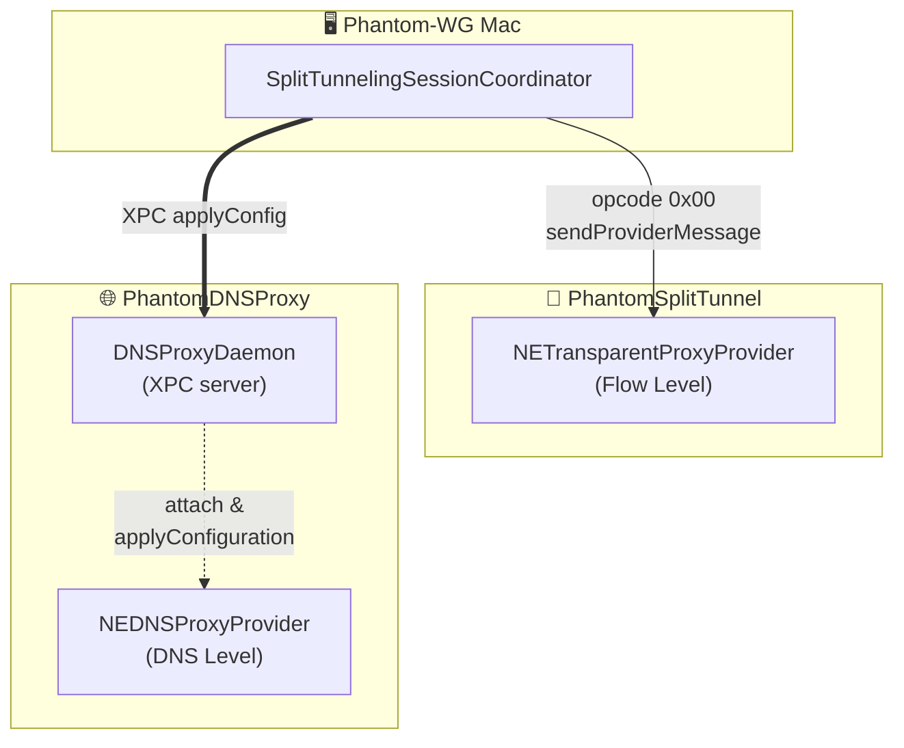
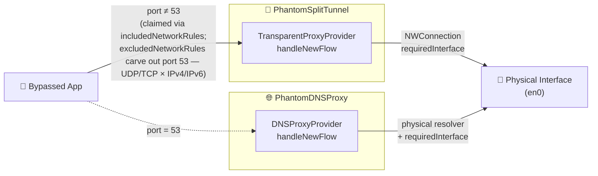

# ADR-0003 — Split-Tunneling ve DNS-Proxy Mimarisi

## Durum

Kabul Edildi — 2026-05-09

## Bağlam

Phantom-WG Mac uygulamasındaki Split-Tunneling özelliği, kullanıcının seçtiği uygulamaların trafiğini fiziksel arayüzden (örn. kullanıcının yerel ağı) çıkarır. Geri kalan uygulamalar VPN tüneli üzerinden akmaya devam eder. Split-Tunneling bu durumu karşılayabilmek için asimetrik ve birbirinden bağımsız ancak birbirini tamamlayarak çalışan `PhantomSplitTunnel` ve `PhantomDNSProxy` sistem uzantılarını kullanır. 

Bu iki uzantının beraber çalışmasının temelinde mecburi bir mimari karar vardır. `PhantomSplitTunnel`, flow seviyesinde paketleri işlemekte iyidir, uygulamadaki internet akışının seçilen ağ arayüzü üzerinden aktarılacağını garanti eder. Ancak uygulama bu garantiyle çalışsa da DNS sorguları tünel tarafından sağlanan DNS çözümleyicileri üzerinden çıkmaya meyillidir. Bu durum beraberinde belirli sorunları getirir. Eğer VPN tüneli tarafında belirtilen DNS sunucuları yalnızca VPN tüneli tarafından erişilebilir ise, sorguları bu çözümleyiciler üzerinden geçirmeye meyilli olan uygulama akışı erişilemez duruma sokar. Bu durum tünel üzerindeki DNS çözümleyicilerinin fiziksel arayüz üzerinden sorgulanmasını beraberinde getirir ve sonuç bağlantıyı erişilemeyen bir noktayı sorgulama noktasına getirir. Eğer VPN tüneliniz tarafında belirtilen DNS sunucuları erişilebilir durumda ise, bu durumda da bu çözümleyiciler üzerinden DNS sorguları işlenir. Bu durumlar kullanıcıya sunulan `Split-Tunneling`garantisinin bozulmasına neden olur, bu garanti en basit haliyle seçilen uygulamanın internet trafiğinin seçilen ağ arayüzü üzerinden çıkması ve DNS sorgularının bu ağ arayüzünde belirtilen DNS çözümleyicileri üzerinden aktarılmasıdır. 

macOS, bu sorunu birlikte çözebilecek iki ayrı NetworkExtension provider tipi sunar: `NETransparentProxyProvider` connection-katmanı flow seviyesinde çalışır, `NEDNSProxyProvider` ise DNS çözümleme katmanında çalışır ve orijinal uygulamanın kimliğini korur. Apple'ın çerçeve mimarisi tek bir bundle'ın içerisinde iki provider'ı register etmesine izin vermez. Her sistem uzantısı tek bir provider tipi bildirir. Bu durumun çözümü, birlikte çalışan **iki sistem uzantısı** + bunları runtime'da boğmadan koordine eden tek bir taraf gerektirir. Bu rol ana uygulamaya verilir; zaten `NETunnelProviderManager` / `NEDNSProxyManager` erişimi olan tek süreç odur.



İki sistem uzantısı **hiçbir runtime IPC kanalını paylaşmaz**. Her uzantı kendi yetki alanında bağımsız işler, koordinasyon her zaman ana uygulama üzerinden geçer. İki kontrol kanalı paraleldir — ana uygulama SplitTunnel'a opcode `0x00` ile `sendProviderMessage`, DNSProxy'ye XPC üzerinden `applyConfig` gönderir.

Bu yapının veri yolunda çalışabilmesi için bir kısıt vardır. `NETransparentProxyProvider`'ın `includedNetworkRules`'u port 53 trafiğini kapsadığında, Transparent Proxy, DNS Proxy'i görmeden flow'u claim eder. (Apple DTS engineer Matt Eaton developer forumlarında doğruladı: iki provider'ın kuralları çakıştığında transparent proxy kazanır) 

DNS'in `NEDNSProxyProvider`'ın alanında kalmasının tek yolu `NETransparentProxyProvider`'ın port 53'ü `excludedNetworkRules` üzerinden açıkça hariç tutmasıdır. Bu carve-out devreye girdikten sonra iki sistem uzantısının veri yolunda koordine olmasına gerek kalmaz; trafik aşağıdaki gibi paralel iki şeride bölünür:



Bu sayede asymmetric routing'in iki yarısı tek bir fiziksel arayüzde birleşir: veri yarısı `NWConnection.requiredInterface` ile pinlenir.

## Karar

Split-Tunneling, ana uygulama tarafından koordine edilen iki durumsuz sistem uzantısı üzerinden yürütülür. Konfigürasyon ana uygulamadan uzantılara akar. Veri yolu tamamen ağ-kuralı seviyesinde carve-out ile ayrıştırılmıştır.

1. **İki bağımsız uzantı, uzantılar arası iletişim yok.** `PhantomSplitTunnel` (`NETransparentProxyProvider`) listeli uygulamaların DNS dışı flow'larını kullanıcının seçtiği fiziksel arayüze pinler. `PhantomDNSProxy` (`NEDNSProxyProvider`) ise listeli uygulamaların DNS flow'larını aynı arayüzün konfigüre resolver'ına yönlendirir. İki uzantı çalışma zamanında birbirleriyle hiç konuşmaz; her biri kendi konfigürasyonunu kendi adanmış kanalı üzerinden alır ve bağımsız işler.

2. **Ağ-kuralı seviyesinde carve-out.** `PhantomSplitTunnel`, DNS dışı tüm trafiği claim etmek için dual-stack wildcard `includedNetworkRules` kurar ve yanına port 53'ü açıkça muaf tutan dört kalemlik `excludedNetworkRules` ekler.

   Carve-out mimarinin omurgasıdır. Apple çerçevesinde, *Transparent Proxy* ve *DNS Proxy* aynı flow'u talep ettiğinde *Transparent Proxy* kazanır. Carve-out olmadan *DNS Proxy* hiç flow göremez. Port 53'ü hariç tutmak, DNS akışının kendi şeridine geçmesinin tek mekanizmasıdır.

   Dual-stack çift (`0.0.0.0` + `::`), Apple'ın `NWHostEndpoint` API'sinin literal hostname istemesinden kaynaklanır. Tek bir `0.0.0.0/0` kuralı yalnızca IPv4 ile eşleşir; bu nedenle UDP ve TCP × IPv4 ve IPv6 dört kuralın da explicit yazılması gerekir.

3. **Ana uygulama orchestrator'dur.** `SplitTunnelingSessionCoordinator` runtime lifecycle'ını sahiplenir. Dört yaşam evresi vardır: başlat (`start(with:)`), durdur (`stop()`), yeniden yapılandır (`reconfigure(with:)`) ve önyükleme uyumu (`boot(with:)`).

   **Başlat (`start(with:)`)**

   - Her iki uzantı kendi `NEManager` shell'i üzerinden register edilir.
   - SplitTunnel oturumu `startVPNTunnel` ile açılır.
   - DNSProxy bu noktada "register edilmiş ama lazy" durumdadır.
   - OS, DNSProxy provider'ını ancak carve-out'tan geçen ilk DNS flow'unda spawn eder.

   **Durdur (`stop()`)**
   - Önce SplitTunnel disable edilir; carve-out, DNSProxy unwind etmeden gitmiş olur.
   - Ardından DNSProxy disable edilir.

   **Yeniden yapılandır (`reconfigure(with:)`)** — kullanıcı listede bir entry eklediğinde, kaldırdığında veya değiştirdiğinde tetiklenir.

   - SplitTunnel'a opcode `0x00` ile `sendProviderMessage` üzerinden yeni payload iletilir.
   - DNSProxy'ye XPC üzerinden `applyConfig(_:)` ile aynı payload iletilir.
   - Persist edilen `providerConfiguration` da güncellenir; gelecekteki bootstrap'ler en son blob'u görür.

   **Önyükleme uyumu (`boot(with:)`)** gate clear olduktan sonra bir kez çalışır. Coordinator, persist edilen `config.isEnabled` yerine `SplitTunnelProviderManager`'dan canlı oturum durumunu okuyup başlangıç state'i olarak benimser. Persist edilen değer yalnızca canlı oturum bulunmadığında devreye girer. Uygulama close/reopen ve sistem reboot'ları boyunca kullanıcı arayüzünün uzantıların gerçekte ne yaptığını yansıtmasını sağlayan budur.

4. **Ana uygulama ↔ DNSProxy XPC daemon.** DNSProxy uzantısı, App-Group prefix'li bir Mach service ismiyle (`group.com.remrearas.phantom-wg-macos.dnsproxy`) in-process bir `NSXPCListener` (`DNSProxyDaemon`) barındırır. Bu Mach ismi, çıplak `NSXPCListener.resume()`'un geçemediği kullanıcı namespace ↔ sistem namespace bootstrap ayrımını geçmeyi mümkün kılar.

   Ana uygulamanın `DNSProxyDaemonClient`'ı bu kanalı üç RPC için kullanır: `applyConfig` (canlı konfigürasyon push), `fetchLogs` (sheet'in DNS-Proxy tab'ı için log polling) ve `clearLogs` (manuel flush).

   Mach service ismi binary'nin `application-groups` entitlement girdilerinden biriyle literal olarak başlamak zorundadır. `sysextd` aktivasyon sırasında bu prefix'i doğrular ve profile wildcard'ları yetmez. 

5. **Lazy-spawn race koruması.** `NEDNSProxyProvider` lazy çalışır: provider sınıfı yalnızca ilk DNS flow'u indiğinde instantiate edilir. XPC daemon ise uzantının `main.swift`'inin ilk satırından itibaren ayaktadır. Ana uygulama provider doğmadan önce konfigürasyon push ettiğinde, daemon payload'u `pendingConfig` buffer'ında tutar ve client'a başarı cevabı verir; provider sonradan `attach(provider:)` ile bağlandığında buffer çözülüp uygulanır. Buffer apply'de, detach'te ve sonraki herhangi bir push'ta üzerine yazılır.

   ```mermaid
   sequenceDiagram
       App->>Daemon: applyConfig (XPC)
       Daemon->>Daemon: provider == nil → buffer pendingConfig
       Daemon-->>App: reply(true)
       Note over Daemon: ...later, on first DNS flow...
       OS->>Provider: startProxy
       Provider->>Daemon: attach(provider:)
       Daemon->>Provider: applyConfiguration(pendingConfig)
   ```

6. **Flow seviyesinde strict mode.** Bypass'lı bir uygulamanın flow'u geldiğinde kullanıcının seçtiği fiziksel arayüz erişilemez durumdaysa (kablo çekildi, Wi-Fi gitti, explicit arayüz `availableInterfaces`'ten düştü), ilgili provider flow'u OS default route'a düşürmek yerine `POSIX EHOSTUNREACH` ile reddeder. Böylece fiziksel yoldan çıkamayan bypass'lı uygulamalar tünelden sessizce sızmaz.

   Bağlı arayüz gittiğinde aktif relay'ler `forceCloseActiveRelays` ile kapatılır ve `NWConnection`'ın `.waiting` state'inde timeout beklenmez. Kullanıcı uygulamaların başarısız olduğunu görür; `InterfaceUnavailableBanner` durumu yüzeye çıkarır ve `Auto'ya Geç` / `Özelliği Kapat` kurtarma yollarını sunar.

7. **Paylaşılan uzantı domain'i.** Her iki uzantının ihtiyaç duyduğu kod, source list üzerinden iki target tarafından paylaşılan ayrılmış bir dizinde yaşar. Yerleşim üç katmanlıdır:

   - **`Extensions/Domain/`** — iki sistem-uzantısı target'ının paylaştığı kod (`InterfaceMonitor`, `RingBufferLogger`, `FlowDecisionEngine`).
   - **`Phantom-WG-MacOS/Domain/`** — yalnızca ana uygulama ↔ uzantı sınırını gerçekten geçen tipler (`SplitTunnelingConfiguration`, `DNSProxyDaemonProtocol`, `SharedConstants`).
   - **Uzantı-yerel** — yalnızca tek bir uzantının kullandığı tipler kendi dizini altında yaşar (örn. `PhantomDNSProxy/Infrastructure/InterfaceDNSResolver`).

   Bu yerleşim, ana uygulama domain'ini host sürecin asla çalıştırmadığı koddan arındırır. Cross-cutting sınır yalnız dizin düzeniyle görünür hale gelir.

   ```text
   Phantom-WG-MacOS/        # ana uygulama
     Domain/                # yalnız sınırı geçen tipler
   Extensions/
     Domain/                # iki uzantının paylaştığı kod
   PhantomSplitTunnel/      # uzantı-yerel
   PhantomDNSProxy/         # uzantı-yerel
   ```

8. **Sistem DNS resolver toggle'ı liste üyeliğini kullanır.** Kullanıcı sheet'teki "Sistem DNS Resolver" toggle'ını açarak `mDNSResponder`'ın DNS sorgularını DNSProxy'den geçirmeyi tercih edebilir. Toggle'ın ayrı persist edilen bir bool'u yoktur. Durumu, sentetik `com.apple.mDNSResponder` ve `com.apple.mDNSResponderHelper` girdilerinin `configuration.apps`'te bulunup bulunmadığıdır. Bu, ***single source of truth*** ilkesinin data model katmanında uygulanmasıdır; toggle pozisyonu ile gerçekte konfigüre edilmiş app listesinin uyuşmadığı bir an olamaz.

## Sonuçlar

- **DNS leak normal işleyişte kapalı.** Her iki uzantı çalışırken, listeli bir uygulamadan gelen her DNS sorgusu — mDNSResponder üzerinden veya doğrudan — DNSProxy tarafından yakalanır ve fiziksel arayüzün resolver'ına pinlenir. Uygulamanın sonraki data flow'u SplitTunnel tarafından yakalanır ve aynı arayüze pinlenir. Asymmetric routing yok: her iki yarı fiziksel olarak gider.
- **İki onay diyalogu, bir değil.** İki uzantıya bölünmek sistem-uzantısı katmanında kullanıcının ilk kurulum sürtünmesini iki katına çıkarır. Bunu `Extension Gate` mekanizması (ADR-0002) üzerinden absorbe ettik ve bunu mimarinin sabit maliyeti olarak kabul ediyoruz.
- **Uzantılar bağımsız ve mantık yereldir.** Hiçbir uzantı diğerini izlemez veya koordine olmaz. Her biri konfigürasyonunu okuyup kendi şeridini işleyen stateless bir worker'dır. Tek koordinatör ana uygulamadır ve uzantı içlerini gözetlemez — konfigürasyon push'lar, log okur. Bakım uzantı-bazlı bir endişedir; debug süreçleri kapsayan bir state machine yerine data flow'u takip eder.

## Gelecek Çalışma

Bypass'lı uygulama trafiğinin tünel zarfına dokunmasını tamamen engelleyen sıkı bir kill-switch isteyen kullanıcılar için `NEFilterDataProvider` tabanlı bir uzantı (`PhantomMonitor`) kapsamlandırılıyor. Sıkı kill-switch tasarımı kendi ADR'ında ayrıca belgelenecek.

