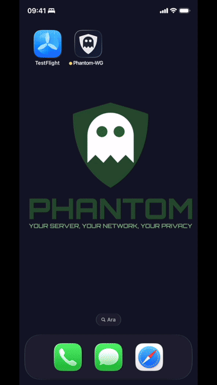

# Phantom-WG iOS Client Application (Beta)

> Ghost Mode on iOS — WireGuard over WebSocket

The Phantom-WG iOS client brings Ghost Mode to your pocket. It connects to your
Phantom-WG server through a WebSocket tunnel (wstunnel) and transfers your WireGuard
traffic as standard HTTPS.

**Join the TestFlight beta:**

---

## How It Works

### Server Setup

The server administrator exports the client configuration using `phantom-casper-ios`.
This command generates a JSON output containing WireGuard interface settings, peer
information, and wstunnel parameters — ready to be scanned or transferred to the iOS app.

### Client Connection

On the iOS side, the app reads the configuration and establishes the connection:
wstunnel opens a WebSocket tunnel to the server, and WireGuard routes traffic
through it — all handled transparently within the app.

---

## Build & Supply Chain

### iOS App

The iOS application's source code resides in the [`ios/main`](https://github.com/ARAS-Workspace/phantom-wg/tree/ios/main) branch of this repository.
The app is built via GitHub Actions and delivered to Apple.

| Detail      | Value                                                                    |
|-------------|--------------------------------------------------------------------------|
| Version     | `1.0.2`                                                                  |
| Build       | `20260213.1313`                                                          |
| Source code | [`ios/main`](https://github.com/ARAS-Workspace/phantom-wg/tree/ios/main) |

**Build Action:** [phantom-wg/actions/runs/21983006116](https://github.com/ARAS-Workspace/phantom-wg/actions/runs/21983006116)

### wstunnel — FFI for iOS

The upstream [wstunnel](https://github.com/erebe/wstunnel) project is a Rust-based
WebSocket tunneling tool. To use it on iOS, it is compiled as a static library via FFI
(Foreign Function Interface) and packaged as **WstunnelKit** — a Swift-compatible
framework that the iOS app links against.

The build process runs on GitHub Actions. When the workflow checks out the `ios/main`
branch, it compiles the Rust source for Apple targets and produces the framework under
`Libraries/`. The resulting artifact includes **checksum verification** so the iOS
project can validate that the binary it links matches exactly what the CI produced —
no manual builds, no unverified binaries.

| Resource           | Link                                                                                                     |
|--------------------|----------------------------------------------------------------------------------------------------------|
| Source (ios tag)   | [wstunnel/tree/ios/v10.5.2](https://github.com/ARAS-Workspace/wstunnel/tree/ios/v10.5.2)                 |
| Build Action       | [wstunnel/actions/runs/21937285430](https://github.com/ARAS-Workspace/wstunnel/actions/runs/21937285430) |

### WireGuard — iOS Fork

The WireGuard integration on iOS is based on a minimal fork of the upstream
[wireguard-apple](https://github.com/WireGuard/wireguard-apple) project, adapted
for Phantom-WG's development environment requirements.

| Resource    | Link                                                                                                         |
|-------------|--------------------------------------------------------------------------------------------------------------|
| Fork branch | [wireguard-apple/tree/ios/phantom-wg](https://github.com/ARAS-Workspace/wireguard-apple/tree/ios/phantom-wg) |

---

## License

Copyright (c) 2025 Riza Emre ARAS <r.emrearas@proton.me>

This software is licensed under the AGPL-3.0 license. See [LICENSE](LICENSE) for details.

For third-party licenses, see [THIRD_PARTY_LICENSES](THIRD_PARTY_LICENSES).

---

<!--suppress HtmlDeprecatedAttribute -->

