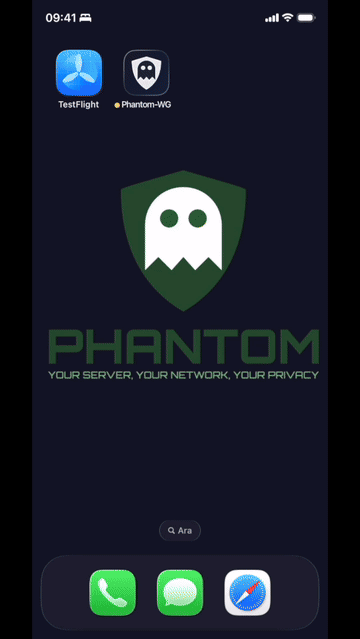
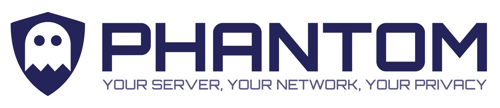

# Phantom-WG iOS Client Application (Beta)

> Ghost Mode on iOS — WireGuard over WebSocket

The Phantom-WG iOS client brings Ghost Mode to your pocket. It connects to your
Phantom-WG server through a WebSocket tunnel (wstunnel) and transfers your WireGuard
traffic as standard HTTPS.

**Join the TestFlight beta:**

---

## How It Works

### Server Setup

The server administrator exports the client configuration using `phantom-casper-ios`.
This command generates a JSON output containing WireGuard interface settings, peer
information, and wstunnel parameters — ready to be scanned or transferred to the iOS app.

### Client Connection

On the iOS side, the app reads the configuration and establishes the connection:
wstunnel opens a WebSocket tunnel to the server, and WireGuard routes traffic
through it — all handled transparently within the app.

---

## License

Copyright (c) 2025 Riza Emre ARAS <r.emrearas@proton.me>

This software is licensed under the AGPL-3.0 license. See [LICENSE](LICENSE) for details.

For third-party licenses, see [THIRD_PARTY_LICENSES](THIRD_PARTY_LICENSES).

---

<!--suppress HtmlDeprecatedAttribute -->

