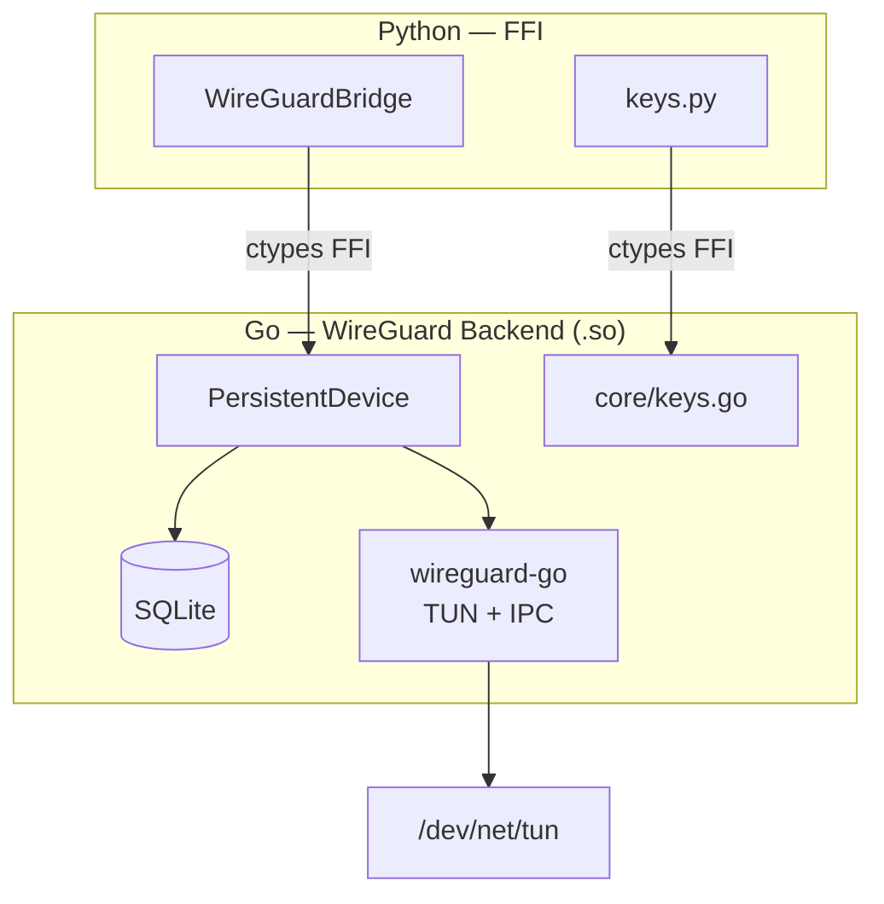
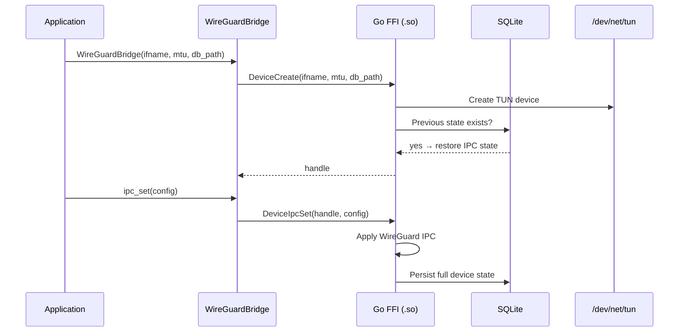
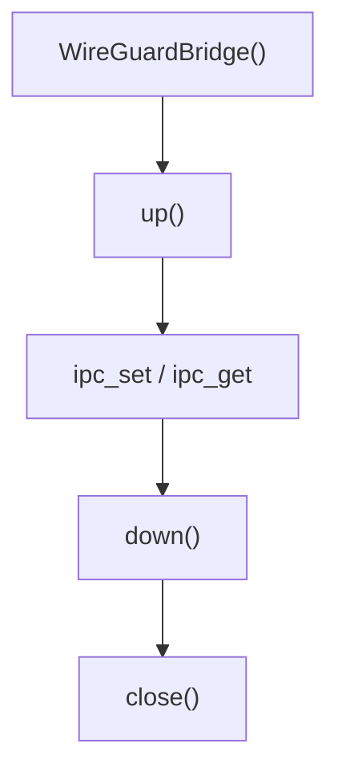

# wireguard-go-bridge

Userspace WireGuard — Go backend, SQLite IPC state persistence, Python FFI.

- Go backend: wireguard-go TUN device + IPC protocol, every state change persisted to SQLite.
- Python layer: ctypes FFI binding, key generation, bridge lifecycle.
- No kernel module required — fully userspace.

## Architecture



## Database

Go backend persists state to SQLite with a single table:

```sql
CREATE TABLE IF NOT EXISTS ipc_state (
    id    INTEGER PRIMARY KEY CHECK (id = 1),
    dump  TEXT NOT NULL
);
```

The `dump` column holds the full device state in WireGuard IPC protocol format (private key, listen port, peers). Overwritten on every `ipc_set` call, restored on startup via `restore()`.

## Layers

| Layer                  | Responsibility                                               |
|------------------------|--------------------------------------------------------------|
| `bridge.py`            | WireGuardBridge lifecycle — create, ipc_set, up, down, close |
| `keys.py`              | Key generation — private, public, preshared, hex↔base64      |
| `_ffi.py`              | cdylib load, ctypes binding                                  |
| `types.py`             | Error types                                                  |
| `persistent_device.go` | WireGuard device + automatic IPC state persistence           |
| `exports.go`           | C FFI export layer — public API surface                      |
| `core/keys.go`         | Curve25519 key generation                                    |
| `core/registry.go`     | Handle registry — device handle management                   |

## Loading

```python
from wireguard_go_bridge import WireGuardBridge

bridge = WireGuardBridge(
    ifname="wg_phantom_main",
    mtu=1420,
    db_path="/var/lib/phantom/state/db/wireguard/wg_phantom_main/device.db",
)
```

## IPC Configuration Format (UAPI)

```text
private_key={hex}
listen_port={int}
replace_peers=true
public_key={hex}
preshared_key={hex}
allowed_ip={ipv4}/32
allowed_ip={ipv6}/128
persistent_keepalive_interval={int}
```

## Key Generation

```python
from wireguard_go_bridge.keys import (
    generate_private_key,
    derive_public_key,
    generate_preshared_key,
)

private = generate_private_key()       # Curve25519 (hex)
public  = derive_public_key(private)   # Public key (hex)
psk     = generate_preshared_key()     # PSK (hex)
```

## Exception Types

| Exception           | Description                    |
|---------------------|--------------------------------|
| `BridgeError`       | Base error class               |
| `TunCreateError`    | TUN interface creation failure |
| `DeviceCreateError` | Device creation failure        |
| `IpcError`          | IPC communication failure      |
| `DeviceUpError`     | Interface activation failure   |
| `DeviceDownError`   | Interface deactivation failure |

## State Persistence



## Lifecycle



## Directory Structure

```
wireguard-go-bridge/
├── src/                        # Go — WireGuard backend
│   ├── main.go                 # cgo entry
│   ├── exports.go              # C FFI exports
│   ├── persistent_device.go    # Device + SQLite persistence
│   ├── handle_registry.go      # Device handle management
│   ├── errors.go               # Error codes
│   ├── version.go              # BridgeVersionStr
│   ├── wireguard_go_bridge.h   # C FFI header
│   └── core/
│       ├── keys.go             # Curve25519 key ops
│       └── registry.go         # Handle registry
├── wireguard_go_bridge/        # Python — FFI + keys
│   ├── __init__.py             # public API, __version__
│   ├── bridge.py               # WireGuardBridge wrapper
│   ├── keys.py                 # Key generation utilities
│   ├── _ffi.py                 # ctypes bindings
│   └── types.py                # error types
├── tests/                      # Unit + integration tests
└── .github/
    ├── workflows/              # CI/CD
    └── scripts/publish.sh      # R2 publish trigger
```

## Development

```bash
# Test (Go build + pytest inside Docker container)
python test_runner.py

# Publish (triggers workflow_dispatch)
.github/scripts/publish.sh
```

## Version

Single source of truth: `wireguard_go_bridge/__init__.py` → `__version__`

Go side: `src/version.go` → `BridgeVersionStr` (validated to match during publish).

## License

AGPL-3.0 — [LICENSE](LICENSE) | [THIRD_PARTY_LICENSES](THIRD_PARTY_LICENSES)
