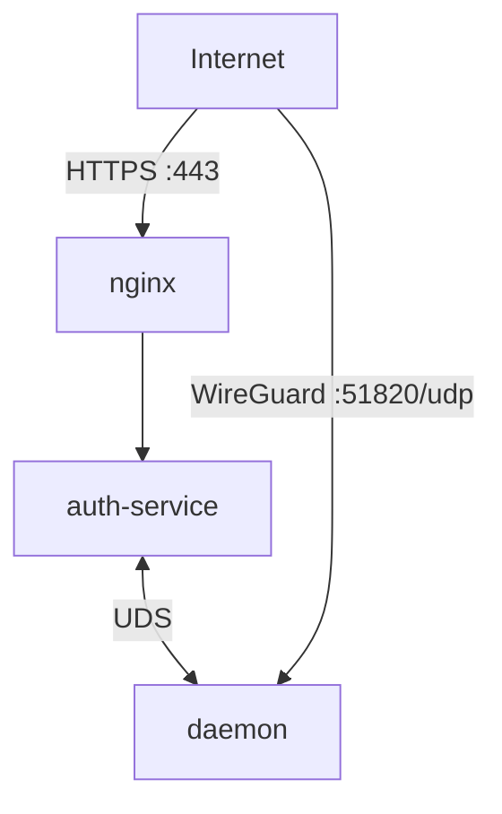
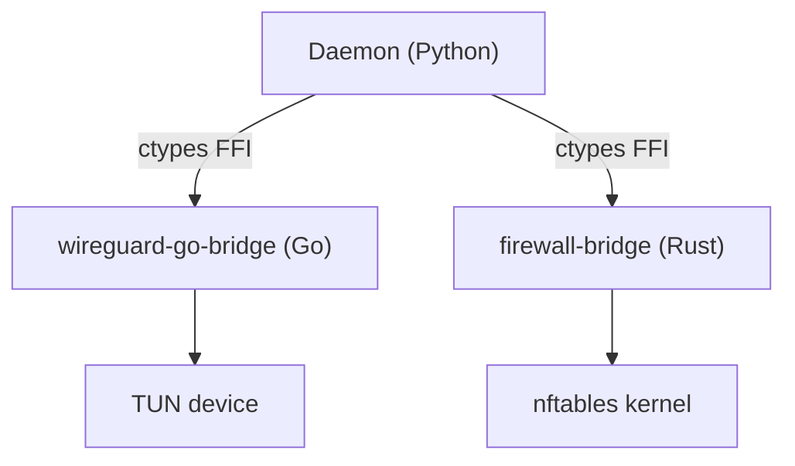
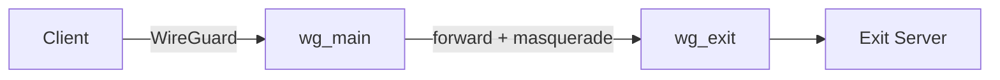

<div align="center">

<picture>
  <source media="(prefers-color-scheme: dark)" srcset="https://raw.githubusercontent.com/ARAS-Workspace/phantom-wg/press-kit/assets/phantom-vertical-master-stellar-silver.svg">
  <source media="(prefers-color-scheme: light)" srcset="https://raw.githubusercontent.com/ARAS-Workspace/phantom-wg/press-kit/assets/phantom-vertical-master-midnight-phantom.svg">
  
</picture>

[](https://github.com/ARAS-Workspace/phantom-wg/actions/workflows/release-modern.yml)
[](LICENSE)
[](https://www.phantom.tc/docs)

<picture>
  <source media="(prefers-color-scheme: dark)" srcset="https://raw.githubusercontent.com/ARAS-Workspace/phantom-wg/press-kit/assets/dashboard-screenshot-dark-en.png">
  <source media="(prefers-color-scheme: light)" srcset="https://raw.githubusercontent.com/ARAS-Workspace/phantom-wg/press-kit/assets/dashboard-screenshot-light-en.png">
  
</picture>

</div>

---

## What is Phantom-WG Modern?

***Phantom-WG*** is a modular tool that lets you set up and manage a WireGuard VPN infrastructure on your own server. Beyond basic VPN management, it offers censorship-resistant connections, multi-layered encryption, and advanced privacy scenarios.

***Phantom-WG Modern*** is the container-native implementation of this vision. All components run within Docker and are isolated from the host system:

- **Userspace WireGuard** — Container-scoped TUN device via Go FFI bridge. No kernel module required, does not touch the host's network namespace.
- **nftables netlink FFI** — Rust backend communicates directly with the kernel. No subprocess calls, firewall rules are managed programmatically.
- **SQLite State Persistence** — All state is stored in SQLite databases. A daemon restart after a crash is sufficient — kernel state is rebuilt from the DB.
- **Dual-Stack IPv6** — Even without IPv6 on the host, an IPv6 subnet is assigned within the container and traffic is carried through the tunnel.
- **Container Isolation** — `NET_ADMIN` + `NET_RAW` is sufficient. WireGuard interfaces live within the container namespace. Configurations that weaken host security such as `SYS_ADMIN`, `privileged`, or `host` network mode are not used.


---

## Topology

Three containers, managed via Docker Compose. Management traffic passes through TLS + JWT authentication, WireGuard traffic reaches the daemon directly.



| Component        | Role                                                                                                |
|------------------|-----------------------------------------------------------------------------------------------------|
| **nginx**        | TLS termination, React SPA (static compiled files), reverse proxy configuration                     |
| **auth-service** | Comprehensive authentication system, API proxy to daemon over UDS                                   |
| **daemon**       | Userspace WireGuard (Go FFI), nftables firewall (Rust FFI), client and tunnel management, databases |

---

## Key Features

### Bridge Architecture

The daemon performs system-level operations through two native bridges. Python manages the business logic, bridges communicate directly with the kernel.



| Bridge                  | Language | Responsibility                                         |
|-------------------------|----------|--------------------------------------------------------|
| **wireguard-go-bridge** | Go       | Userspace WireGuard, TUN device, IPC state persistence |
| **firewall-bridge**     | Rust     | nftables rule groups, policy routing, preset system    |

### Multihop Exit Routing

You can define your exit tunnel to route traffic through an external WireGuard VPN server. IPv4 and IPv6 tunnels are supported simultaneously.



### IPv6 Dual-Stack

IPv6 support across all layers — firewall rules, policy routing, masquerade, and multihop presets operate with `family: 10` (AF_INET6). IPv6 tunnel traffic can be carried from within the container even without an IPv6 address on the host.

### Crash Recovery

When the service starts, kernel state (nftables rules, routing policies) is rebuilt from SQLite state databases. No data loss after an unexpected shutdown.

---

## Auth-Service (Authentication and Secure Proxy Layer)

Access to the daemon is protected by an independent authentication service. Auth-service runs in a separate container from the daemon and proxies API requests over UDS.

### Authentication

| Feature                     | Detail                                                                                           |
|-----------------------------|--------------------------------------------------------------------------------------------------|
| Session management          | JWT (Ed25519 signed)                                                                             |
| Multi-factor authentication | TOTP (RFC 6238), backup code access                                                              |
| Password storage            | Argon2id hash                                                                                    |
| Brute-force protection      | IP-based rate limiting (configurable sliding window and attempt-based configuration)             |
| Audit log                   | All authentication and API proxy events are logged per user (login, logout, failed attempt, MFA) |

### RBAC (Role-Based Access Control)

| Permission                                             | Superadmin | Admin |
|--------------------------------------------------------|:----------:|:-----:|
| Daemon management (client, multihop, firewall, backup) |     ✓      |   ✓   |
| Change own password                                    |     ✓      |   ✓   |
| Configure own TOTP                                     |     ✓      |   ✓   |
| Create / delete admin accounts                         |     ✓      |   —   |
| Change any user's password                             |     ✓      |   —   |
| Disable another user's TOTP                            |     ✓      |   —   |
| View audit log                                         |     ✓      |   —   |

> [!TIP]
> The account created during initial setup has the `superadmin` role. If multiple people manage the server, `admin` accounts can be created for operational access — administrative privileges remain with the superadmin.

Both roles can manage the daemon at the same permission level — all operations executed through the daemon such as client creation, multihop, firewall, and backup are shared. The distinction is only on the auth-service side: superadmin has user management and audit authority, while admin has only operational access. Auth-service is an independent component — customizations do not affect the daemon structure. The daemon is unaware of this service's existence and only handles network operations. If you want to isolate different user groups, instead of authorization through auth-service, you can set up a multi-tenant structure running on the same host through configuration changes. This way, you can create independent instances by multiplying port and network configurations while ensuring isolation on both the network and user access sides. These operational configurations are for advanced users who want to adapt the existing structure to their own scenario.

---

## Installation

**Prerequisites:** Docker Engine 20.10+, Docker Compose v2, bash.

```bash
curl -sSL get.phantom.tc | bash
```

<picture>
  <source media="(prefers-color-scheme: dark)" srcset="https://raw.githubusercontent.com/ARAS-Workspace/phantom-wg/press-kit/assets/phantom-wg-install-dark.gif">
  <source media="(prefers-color-scheme: light)" srcset="https://raw.githubusercontent.com/ARAS-Workspace/phantom-wg/press-kit/assets/phantom-wg-install-light.gif">
  
</picture>

### Configuration

```bash
cd phantom-wg

# First-time setup
./tools/prod.sh setup

# Endpoint configuration
IPV4=$(curl -4 -sSL https://get.phantom.tc/ip)
IPV6=$(curl -6 -sSL https://get.phantom.tc/ip)
sed -i "s/^WIREGUARD_ENDPOINT_V4=.*/WIREGUARD_ENDPOINT_V4=${IPV4}/" .env.daemon
sed -i "s/^WIREGUARD_ENDPOINT_V6=.*/WIREGUARD_ENDPOINT_V6=${IPV6}/" .env.daemon

# Start
./tools/prod.sh up
```

**Access:**
- Dashboard: `https://<server-ip>`
- WireGuard: UDP port `51820`
- Admin password: `cat container-data/secrets/production/.admin_password`

> [!TIP]
> To access the dashboard while connected to the VPN, use the nginx container's Docker network address:
> ```bash
> docker inspect phantom-nginx --format '{{range .NetworkSettings.Networks}}IPv4: {{.IPAddress}} | IPv6: {{.GlobalIPv6Address}}{{end}}'
> ```
> Accessible via `https://<IPv4>` or `https://[<IPv6>]` through the tunnel. You can also remove the `ports: "443:443"` line from `docker-compose.yml` to make the dashboard accessible only through the VPN tunnel.

---

## Environment Variables

Configuration is managed through env files created from templates during setup:

| File                | Service      |
|---------------------|--------------|
| `.env.daemon`       | daemon       |
| `.env.auth-service` | auth-service |

See `.example` files for all available options.

---

## Management

A convenient tool is available at `./tools/prod.sh` for management.

| Command                 | Description                                  |
|-------------------------|----------------------------------------------|
| `setup`                 | Full Setup                                   |
| `up`                    | Start                                        |
| `down`                  | Stop                                         |
| `restart [service]`     | Restart (All or Specific Service)            |
| `build`                 | Build Images                                 |
| `rebuild`               | Build Images from Scratch (no-cache)         |
| `update`                | Update (git pull + restart)                  |
| `update --skip-compose` | Update (exclude docker-compose.yml)          |
| `logs [service]`        | Log Tracking (All or Specific Service)       |
| `status`                | Docker Compose Status                        |
| `show-versions`         | Component Versions (Daemon, Vendor Packages) |
| `shell [service]`       | Shell (default: daemon)                      |
| `exec <svc> <cmd>`      | Execute Command                              |
| `hard-reset`            | Delete All Data                              |

### Setup

The `setup` command creates all required components during first-time installation:

1. Creates `.env.daemon` and `.env.auth-service` files from `.example` templates.
2. Generates WireGuard server key pair. (Curve25519 — `wg_private_key`, `wg_public_key`)
3. Auth-Service bootstrap cycle:
   - Generates Ed25519 signing key pair. (`auth_signing_key`, `auth_verify_key`)
   - Creates auth database. (`auth.db` — users, sessions, TOTP, audit log)
   - Creates admin account. (32-character random password encrypted with Argon2id hash)
4. Generates self-signed TLS certificate for nginx. (`tls_cert`, `tls_key`)

All of these operations take place within the container — no additional dependencies or tools need to be installed on the host.

> [!TIP]
> Secret keys are stored under `container-data/secrets/production/`. The admin password is written to `.admin_password` in the same directory — you can safely remove it after logging in.

### Updating

```bash
./tools/prod.sh update                 # git pull + restart
./tools/prod.sh update --skip-compose  # Preserve compose file
```

> [!TIP]
> If you have made configuration changes to `docker-compose.yml` and want to receive updates, use `--skip-compose`.

For package dependency changes that require container recompilation (Dockerfile, requirements.txt):

```bash
./tools/prod.sh rebuild
./tools/prod.sh up
```

> [!TIP]
> Dockerfiles only provide the system dependencies needed for the stack to run. Code updates are received with the `update` command — `rebuild` is only required when these dependencies change (in updates requiring container recompilation).

---

## Architecture

For detailed architecture documentation, visit [www.phantom.tc/docs/architecture](https://www.phantom.tc/docs/architecture).

| Resource      | URL                                                                          |
|---------------|------------------------------------------------------------------------------|
| Website       | [www.phantom.tc](https://www.phantom.tc)                                     |
| Architecture  | [www.phantom.tc/docs/architecture](https://www.phantom.tc/docs/architecture) |
| API Reference | [www.phantom.tc/docs/api](https://www.phantom.tc/docs/api)                   |
| Setup Guide   | [SETUP](SETUP)                                                               |

---

## Development

Active development takes place on the [`dev/daemon`](https://github.com/ARAS-Workspace/phantom-wg/tree/dev/daemon) branch. The `main` branch contains production-ready releases only.

---

## Phantom-WG Retro


If you are looking for advanced privacy features and a solution that runs solely on system services, [Phantom-WG Retro](https://github.com/ARAS-Workspace/phantom-wg/tree/retro) may interest you.

### MultiGhost - Maximum Privacy

Achieve the highest level of privacy and censorship resistance by using Ghost and Multihop modules together. Your connection is masked as HTTPS and routed through a double VPN layer.


**Activation:**
```bash
# 1. Enable Ghost Mode
phantom-api ghost enable domain="cdn.example.com"

# 2. Import external VPN
phantom-api multihop import_vpn_config config_path="/path/to/vpn.conf"

# 3. Enable Multihop
phantom-api multihop enable_multihop exit_name="vpn-exit"
```

### Explore

|    | Resource      | Link                                                                           |
|----|---------------|--------------------------------------------------------------------------------|
| 🌐 | Homepage      | [www.phantom.tc](https://www.phantom.tc)                                       |
| 📖 | Documentation | [retro-docs.phantom.tc](https://retro-docs.phantom.tc)                         |
| 💻 | Source Code   | [GitHub Repository](https://github.com/ARAS-Workspace/phantom-wg/tree/retro)   |
| 🍎 | Mac Client    | [v1.0.0](https://github.com/ARAS-Workspace/phantom-wg/releases/tag/mac-v1.0.0) |

---

## Trademark Notice

WireGuard® is a registered trademark of Jason A. Donenfeld.

This project is not affiliated, associated, authorized, endorsed by, or in any way officially connected with Jason A. Donenfeld, ZX2C4 or Edge Security.

---

## License

Copyright (c) 2025 Riza Emre ARAS

Licensed under [AGPL-3.0](LICENSE). See [THIRD_PARTY_LICENSES](THIRD_PARTY_LICENSES) for dependency licenses.
