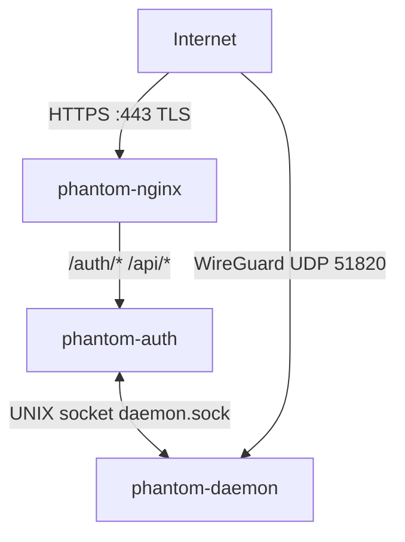
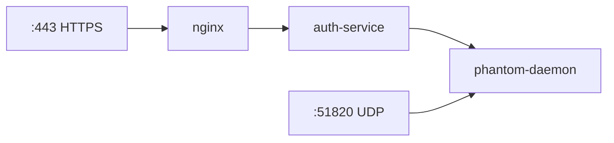

<div align="center">

<picture>
  <source media="(prefers-color-scheme: dark)" srcset="assets/phantom-vertical-master-stellar-silver.svg">
  <source media="(prefers-color-scheme: light)" srcset="assets/phantom-vertical-master-midnight-phantom.svg">
  
</picture>

[](https://github.com/ARAS-Workspace/phantom-wg/actions/runs/23315327358)
[](https://github.com/ARAS-Workspace/phantom-wg/releases/tag/v1.0.0)
[](LICENSE)
[](https://www.phantom.tc/docs)

<picture>
  <source media="(prefers-color-scheme: dark)" srcset="assets/dashboard-screenshot-dark.png">
  <source media="(prefers-color-scheme: light)" srcset="assets/dashboard-screenshot-light.png">
  
</picture>

</div>

> [!NOTE]
> If you are looking for advanced privacy features and a solution that runs solely on system services, you may be interested in [Phantom-WG Retro](https://github.com/ARAS-Workspace/phantom-wg/tree/retro).

---

## Overview

***Phantom-WG Modern*** is a WireGuard®-based VPN management platform. All components run within a Docker container architecture, and the core component Phantom Daemon communicates over Unix Domain Socket (UDS).



The Production Topology consists of three containers orchestrated via Docker Compose. The primary objective of the architecture is to securely forward queries to the Daemon.



---

## Installation

**Prerequisites:** Docker Engine 20.10+, Docker Compose v2, bash.

```bash
curl -sSL get.phantom.tc | bash
```

<picture>
  <source media="(prefers-color-scheme: dark)" srcset="assets/phantom-wg-install-dark.gif">
  <source media="(prefers-color-scheme: light)" srcset="assets/phantom-wg-install-light.gif">
  
</picture>

### Setup

```bash
cd phantom-wg

# First-time setup (keys, auth DB, TLS certificate, env files)
./tools/prod.sh setup

# Endpoint configuration
IPV4=$(curl -4 -sSL https://get.phantom.tc/ip)
IPV6=$(curl -6 -sSL https://get.phantom.tc/ip)
sed -i "s/^WIREGUARD_ENDPOINT_V4=.*/WIREGUARD_ENDPOINT_V4=${IPV4}/" .env.daemon
sed -i "s/^WIREGUARD_ENDPOINT_V6=.*/WIREGUARD_ENDPOINT_V6=${IPV6}/" .env.daemon

# Start
./tools/prod.sh up
```

**Access:**
- Dashboard: `https://<server-ip>`
- WireGuard: UDP port `51820`
- Admin password: `cat container-data/secrets/production/.admin_password`

---

## Environment

Configuration is managed through two env files, created from templates during setup:

| File                | Service        | Key Settings                                 |
|---------------------|----------------|----------------------------------------------|
| `.env.daemon`       | phantom-daemon | WireGuard port, MTU, keepalive, endpoint IP  |
| `.env.auth-service` | phantom-auth   | JWT lifetime, MFA timeout, rate limiting     |

See `.example` files for all available options.

---

## Updating

```bash
git pull
docker compose restart
```

Environment files are preserved across updates. `docker compose build` is only needed when dependencies change.

---

## Architecture

| Component          | Role                                                                         |
|--------------------|------------------------------------------------------------------------------|
| **phantom-nginx**  | TLS termination, SPA static files, reverse proxy                             |
| **phantom-auth**   | JWT authentication, API proxy to daemon over UDS                             |
| **phantom-daemon** | WireGuard interfaces, client management, firewall rules, databases           |

For detailed architecture documentation, visit [www.phantom.tc/docs/architecture](https://www.phantom.tc/docs/architecture).

---

## Documentation

| Resource        | URL                                                                          |
|-----------------|------------------------------------------------------------------------------|
| Website         | [www.phantom.tc](https://www.phantom.tc)                                     |
| Architecture    | [www.phantom.tc/docs/architecture](https://www.phantom.tc/docs/architecture) |
| API Reference   | [www.phantom.tc/docs/api](https://www.phantom.tc/docs/api)                   |
| Setup Guide     | [SETUP](SETUP)                                                               |

---

## Development

Active development happens on the [`dev/daemon`](https://github.com/ARAS-Workspace/phantom-wg/tree/dev/daemon) branch. The `main` branch contains production-ready releases only.

---

## Trademark Notice

WireGuard® is a registered trademark of Jason A. Donenfeld.

This project is not affiliated, associated, authorized, endorsed by, or in any way officially connected with Jason A. Donenfeld, ZX2C4 or Edge Security.

---

## License

Copyright (c) 2025 Riza Emre ARAS

Licensed under [AGPL-3.0](LICENSE). See [THIRD_PARTY_LICENSES](THIRD_PARTY_LICENSES) for dependency licenses.
