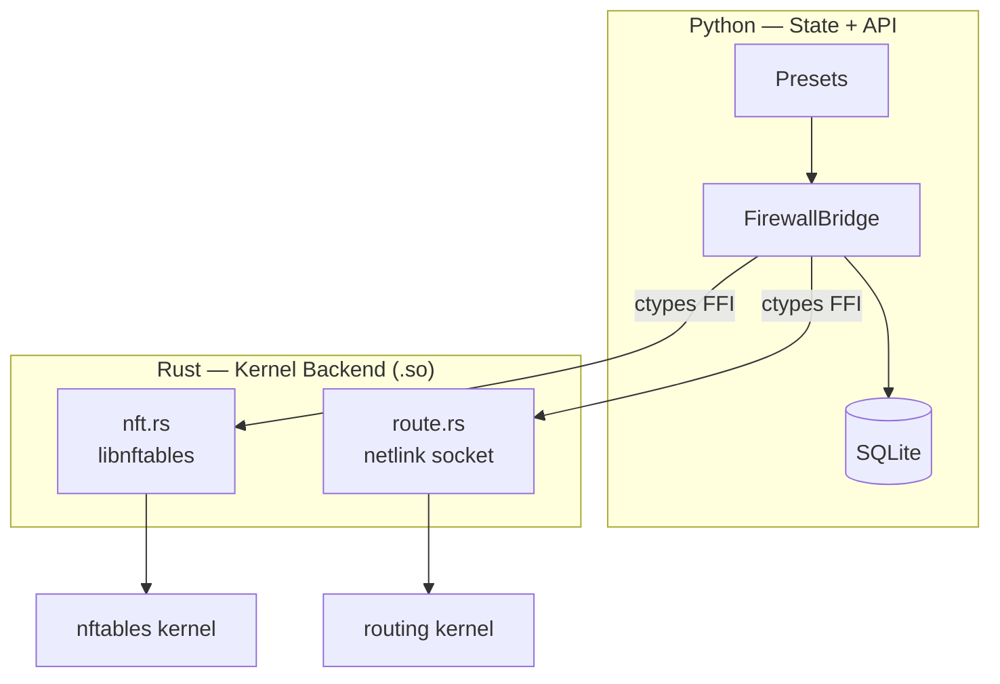
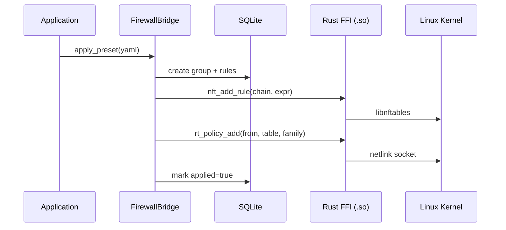
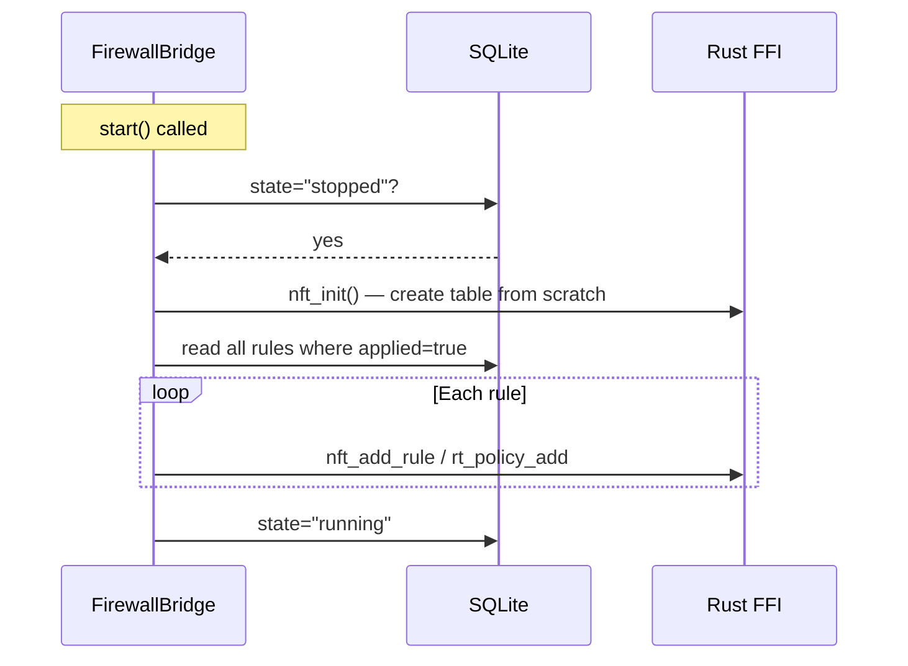
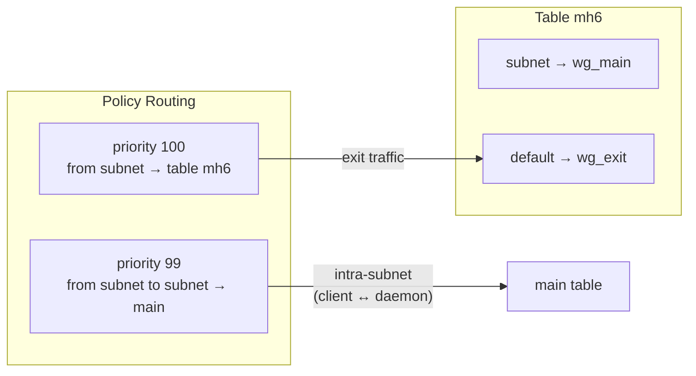

# firewall-bridge

Linux firewall manager — nftables + policy routing, SQLite state, YAML presets.

- Rust backend talks directly to the kernel (netlink socket + libnftables).
- Python layer provides state machine, DB persistence and preset system.

## Architecture



## Layers

| Layer        | Responsibility                                |
|--------------|-----------------------------------------------|
| `bridge.py`  | State machine, DB CRUD, FFI dispatch          |
| `presets.py` | YAML parse, group create, batch rule apply    |
| `db.py`      | SQLite persistence, migration, WAL mode       |
| `_ffi.py`    | cdylib load, ctypes binding                   |
| `nft.rs`     | nftables chain/rule CRUD — libnftables        |
| `route.rs`   | Policy routing + route table — netlink socket |

## Data Flow



## Crash Recovery



DB is the source of truth. Kernel state is rebuilt from DB on every start. A daemon restart is sufficient after a crash.

## Preset Structure

```yaml
name: multihop-exit-v6
priority: 80
metadata:
  description: Forward IPv6 traffic wg_main to wg_exit

table:
  - ensure: {id: 201, name: mh6, family: 10}
  - policy: {from: "fd00:10:1::/64", to: "fd00:10:1::/64", table: main, priority: 99, family: 10}
  - policy: {from: "fd00:10:1::/64", table: mh6, priority: 100, family: 10}
  - route:  {destination: default, device: wg_exit, table: mh6, family: 10}

rules:
  - chain: forward
    action: accept
    family: 10
    in_iface: wg_main
    out_iface: wg_exit
  - chain: postrouting
    action: masquerade
    family: 10
    source: "fd00:10:1::/64"
    out_iface: wg_exit
```

`family: 10` = AF_INET6, `family: 2` (default) = AF_INET.

## Dual-Stack IPv6



The priority 99 rule routes intra-subnet traffic (client replies) through the main table. Without it, reply packets would be sent to the exit tunnel.

## Directory Structure

```
firewall-bridge/
├── src/                    # Rust — kernel backend
│   ├── lib.rs              # FFI export, nft context
│   ├── nft.rs              # nftables chain/rule ops
│   ├── route.rs            # netlink policy routing
│   └── error.rs            # error codes
├── include/
│   └── firewall_bridge_linux.h  # C FFI header
├── firewall_bridge/        # Python — state + API
│   ├── __init__.py         # public API, __version__
│   ├── bridge.py           # FirewallBridge state machine
│   ├── db.py               # SQLite persistence + migration
│   ├── models.py           # Group, FirewallRule, RoutingRule
│   ├── presets.py          # YAML preset applicator
│   ├── schema.py           # preset validation
│   ├── _ffi.py             # ctypes bindings
│   ├── types.py            # error types
│   └── schemas/schema.sql  # DB schema
├── tests/                  # Unit tests (Docker SDK runner)
├── e2e_tests/              # E2E tests (compose-bridge)
├── dev/                    # Local dev tools
└── .github/
    ├── workflows/          # CI/CD
    └── scripts/publish.sh  # R2 publish trigger
```

## Development

```bash
# Rust tests
dev/build.sh && dev/cargo.sh test --lib

# Python unit tests
python tests/runner.py

# E2E tests (compose-bridge required)
bash fetch_compose_bridge.sh
python e2e_tests/runner.py

# Publish (triggers workflow_dispatch)
.github/scripts/publish.sh
```

## Version

Single source of truth: `firewall_bridge/__init__.py` → `__version__`

CI/CD, publish workflow and VERSION file are all derived from this value.

## License

AGPL-3.0 — [LICENSE](LICENSE) | [THIRD_PARTY_LICENSES](THIRD_PARTY_LICENSES)
