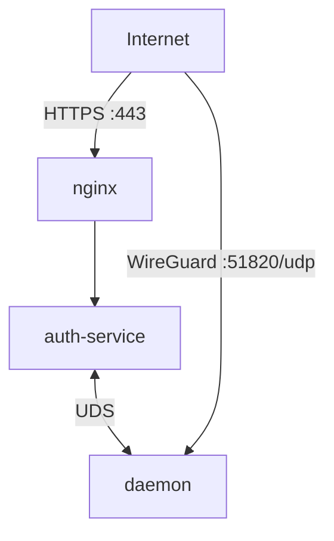
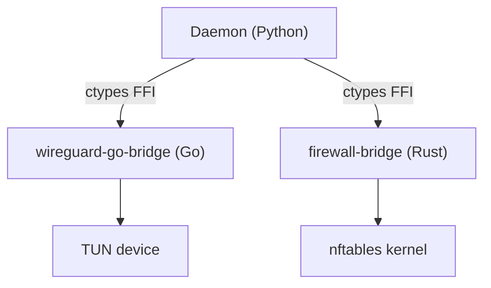
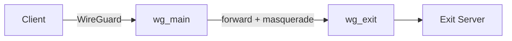

<div align="center">

<picture>
  <source media="(prefers-color-scheme: dark)" srcset="https://raw.githubusercontent.com/ARAS-Workspace/phantom-wg/press-kit/assets/phantom-vertical-master-stellar-silver.svg">
  <source media="(prefers-color-scheme: light)" srcset="https://raw.githubusercontent.com/ARAS-Workspace/phantom-wg/press-kit/assets/phantom-vertical-master-midnight-phantom.svg">
  
</picture>

[](https://github.com/ARAS-Workspace/phantom-wg/actions/workflows/release-modern.yml)
[](LICENSE)
[](https://www.phantom.tc/docs)

<picture>
  <source media="(prefers-color-scheme: dark)" srcset="https://raw.githubusercontent.com/ARAS-Workspace/phantom-wg/press-kit/assets/dashboard-screenshot-dark-tr.png">
  <source media="(prefers-color-scheme: light)" srcset="https://raw.githubusercontent.com/ARAS-Workspace/phantom-wg/press-kit/assets/dashboard-screenshot-light-tr.png">
  
</picture>

</div>

---

## Phantom-WG Modern Nedir?

***Phantom-WG***, kendi sunucunuzda WireGuard VPN altyapısı kurmanızı ve yönetmenizi sağlayan modüler bir araçtır. Temel VPN yönetiminin ötesinde; sansüre dayanıklı bağlantılar, çok katmanlı şifreleme ve gelişmiş gizlilik senaryoları sunar.

***Phantom-WG Modern***, bu vizyonun container-native implementasyonudur. Tüm bileşenler Docker yapısı içerisinde çalışır ve host sistemden izole edilir:

- **Userspace WireGuard** — Go FFI bridge ile container-scoped TUN device. Kernel modülü gerektirmez, host'un network namespace'ine dokunmaz.
- **nftables netlink FFI** — Rust backend doğrudan kernel ile konuşur. Subprocess çağrısı yoktur, firewall kuralları programatik olarak yönetilir.
- **SQLite State Persistence** — Tüm state SQLite veritabanlarında tutulur. Crash sonrası daemon restart yeterlidir — kernel state DB'den yeniden oluşturulur.
- **Dual-Stack IPv6** — Host'ta IPv6 olmasa bile container içinde IPv6 subnet atanır, tünel içinde trafik taşınabilir.
- **Container İzolasyonu** — `NET_ADMIN` + `NET_RAW` yeterlidir. WireGuard arayüzleri container namespace içerisinde yaşar. `SYS_ADMIN`, `privileged` veya `host` network mode gibi host güvenliğini zayıflatan konfigürasyonlar kullanılmaz.


---

## Topoloji

Üç container, Docker Compose ile yönetilir. Yönetim trafiği TLS + JWT kimlik doğrulamadan geçer, WireGuard trafiği doğrudan daemon'a ulaşır.



| Bileşen          | Görev                                                                                                |
|------------------|------------------------------------------------------------------------------------------------------|
| **nginx**        | TLS sonlandırma, React SPA (Statik Derlenmiş Dosyalar), Reverse Proxy Yapılandırması                 |
| **auth-service** | Kapsamlı Kimlik Doğrulama (Authentication) Sistemi, UDS üzerinden daemon'a API proxy                 |
| **daemon**       | Userspace WireGuard (Go FFI), nftables firewall (Rust FFI), İstemci ve Tünel yönetimi, Veritabanları |

---

## Temel Özellikler

### Bridge Mimarisi

Daemon, sistem düzeyindeki işlemleri iki native bridge aracılığıyla gerçekleştirir. Python iş mantığını yönetir, bridge'ler kernel ile doğrudan iletişim kurar.



| Bridge                  | Dil  | Sorumluluk                                              |
|-------------------------|------|---------------------------------------------------------|
| **wireguard-go-bridge** | Go   | Userspace WireGuard, TUN device, IPC state persistence  |
| **firewall-bridge**     | Rust | nftables kural grupları, policy routing, preset sistemi |

### Multihop Exit Routing

Trafiğinizi harici bir WireGuard VPN sunucusu üzerinden aktarmak için exit tünelinizi tanımlayabilirsiniz. IPv4 ve IPv6 tünelleri eş zamanlı olarak desteklenir.



### IPv6 Dual-Stack

IPv6 desteği tüm katmanlarda — firewall kuralları, policy routing, masquerade ve multihop preset'leri `family: 10` (AF_INET6) ile çalışır. Host'ta IPv6 adresi olmadan da container içinden IPv6 tünel trafiği taşınabilir.

### Crash Recovery

Servis başlatıldığında kernel state (nftables kuralları, routing policy'leri) SQLite durum veritabanlarından yeniden oluşturulur. Beklenmeyen kapanma sonrası veri kaybı yaşanmaz.

---

## Auth-Service (Kimlik Doğrulama ve Güvenli Proxy Katmanı)

Daemon'a erişim, bağımsız bir kimlik doğrulama servisi tarafından korunur. Auth-service daemon'dan ayrı bir container'da çalışır ve UDS üzerinden API isteklerini proxy mekanizmasında aktarır.

### Kimlik Doğrulama

| Özellik                       | Detay                                                                                                        |
|-------------------------------|--------------------------------------------------------------------------------------------------------------|
| Oturum yönetimi               | JWT (Ed25519 imzalı),                                                                                        |
| Çok faktörlü kimlik doğrulama | TOTP (RFC 6238), yedek kodlar ile erişim                                                                     |
| Şifre depolama                | Argon2id hash                                                                                                |
| Brute-force koruması          | IP tabanlı rate limiting (yapılandırılabilir sliding window ve deneme sayısı bazlı konfigürasyon)            |
| Denetim kaydı                 | Tüm kimlik doğrulama ve API proxy olayları kullanıcı özelinde loglanır (giriş, çıkış, başarısız deneme, MFA) |

### RBAC (Rol Tabanlı Erişim Kontrolü)

| Yetki                                                | Superadmin | Admin |
|------------------------------------------------------|:----------:|:-----:|
| Daemon yönetimi (client, multihop, firewall, backup) |     ✓      |   ✓   |
| Kendi şifresini değiştirme                           |     ✓      |   ✓   |
| Kendi TOTP yapılandırması                            |     ✓      |   ✓   |
| Admin hesabı oluşturma / silme                       |     ✓      |   —   |
| Herhangi bir kullanıcının şifresini değiştirme       |     ✓      |   —   |
| Başka kullanıcının TOTP'sini devre dışı bırakma      |     ✓      |   —   |
| Audit log görüntüleme                                |     ✓      |   —   |

> [!TIP]
> İlk kurulumda oluşturulan hesap `superadmin` rolündedir. Sunucuyu birden fazla kişi yönetiyorsa operasyonel erişim için `admin` hesapları oluşturulabilir — idari yetkiler superadmin'de kalır.

Her iki rol de daemon'u aynı yetki düzeyinde yönetebilir — client oluşturma, multihop, firewall, backup gibi daemon üzerinden yürütülen tüm operasyonlar ortaktır. 
Ayrım yalnızca auth-service üzerindedir: superadmin kullanıcı yönetimi ve denetim yetkisine sahipken, admin yalnızca operasyonel erişime sahiptir. Auth-service bağımsız bir bileşendir — özelleştirmeler daemon yapısını etkilemez. Daemon bu servisin varlığından haberdar değildir ve yalnızca ağ operasyonları ile ilgilenir. Farklı kullanıcı gruplarını izole etmek istiyorsanız auth-service üzerinde yetkilendirme yerine, yapılandırma değişiklikleri ile aynı host üzerinde çalışan multi-tenant bir yapı kurabilirsiniz. Böylece hem ağ hem de kullanıcı erişimi tarafında izolasyon sağlarken, port ve network konfigürasyonunu çoğaltarak bağımsız instance'lar oluşturabilirsiniz. Bu operasyonel konfigürasyonlar, varolan yapıyı kendi senaryosuna uyarlamak isteyen ileri düzey kullanıcılar içindir.

---

## Kurulum

**Gereksinimler:** Docker Engine 20.10+, Docker Compose v2, bash.

```bash
curl -sSL get.phantom.tc | bash
```

<picture>
  <source media="(prefers-color-scheme: dark)" srcset="https://raw.githubusercontent.com/ARAS-Workspace/phantom-wg/press-kit/assets/phantom-wg-install-dark.gif">
  <source media="(prefers-color-scheme: light)" srcset="https://raw.githubusercontent.com/ARAS-Workspace/phantom-wg/press-kit/assets/phantom-wg-install-light.gif">
  
</picture>

### Yapılandırma

```bash
cd phantom-wg

# İlk kurulum
./tools/prod.sh setup

# Veya özel subnet ile (bkz. https://www.phantom.tc/docs/architecture/terazi)
# ./tools/prod.sh setup --terazi-ipv4-subnet=10.9.0.0/24

# Endpoint yapılandırması
IPV4=$(curl -4 -sSL https://get.phantom.tc/ip)
IPV6=$(curl -6 -sSL https://get.phantom.tc/ip)
sed -i "s/^WIREGUARD_ENDPOINT_V4=.*/WIREGUARD_ENDPOINT_V4=${IPV4}/" .env.daemon
sed -i "s/^WIREGUARD_ENDPOINT_V6=.*/WIREGUARD_ENDPOINT_V6=${IPV6}/" .env.daemon

# Başlatma
./tools/prod.sh up
```

**Erişim:**
- Kontrol Paneli: `https://<sunucu-ip>`
- WireGuard: UDP port `51820`
- Admin şifresi: `cat container-data/secrets/production/.admin_password`

> [!TIP]
> VPN'e bağlıyken kontrol paneline erişmek için nginx container'ın Docker network adresini kullanabilirsiniz:
> ```bash
> docker inspect phantom-nginx --format '{{range .NetworkSettings.Networks}}IPv4: {{.IPAddress}} | IPv6: {{.GlobalIPv6Address}}{{end}}'
> ```
> Tünel içerisinden `https://<IPv4>` veya `https://[<IPv6>]` adresi ile erişilebilir. Dilerseniz `docker-compose.yml` dosyasından `ports: "443:443"` satırını kaldırarak kontrol panelini yalnızca VPN tüneli üzerinden erişilebilir hale getirebilirsiniz.

---

## Ortam Değişkenleri

Yapılandırma, kurulum sırasında şablonlardan oluşturulan env dosyaları ile yönetilir:

| Dosya               | Servis       |
|---------------------|--------------|
| `.env.daemon`       | daemon       |
| `.env.auth-service` | auth-service |

Tüm seçenekler için `.example` dosyalarına bakın.

---

## Yönetim

Yönetim için `./tools/prod.sh` konumunda kullanışlı bir araç bulunur.

| Komut                               | Açıklama                                        |
|-------------------------------------|-------------------------------------------------|
| `setup`                             | Tam Kurulum                                     |
| `setup --terazi-ipv4-subnet=SUBNET` | Özel subnet ile kurulum (ör. `10.9.0.0/24`)     |
| `up`                                | Başlat                                          |
| `down`                              | Durdur                                          |
| `restart [service]`                 | Yeniden Başlat (Tümü veya Belirli Servis)       |
| `build`                             | İmaj Derle                                      |
| `rebuild`                           | Sıfırdan İmaj Derle (no-cache)                  |
| `update`                            | Güncelle (git pull + restart)                   |
| `update --skip-compose`             | Güncelle (docker-compose.yml hariç tut)         |
| `logs [service]`                    | Log Takibi (Tümü veya Belirli Servis)           |
| `status`                            | Docker Compose Durumu                           |
| `show-versions`                     | Bileşen Versiyonları (Daemon, Vendor Paketleri) |
| `shell [service]`                   | Shell (varsayılan: daemon)                      |
| `exec <svc> <cmd>`                  | Komut Çalıştır                                  |
| `hard-reset`                        | Tüm Veriyi Sil                                  |

### Kurulum

`setup` komutu ilk kurulumda gerekli tüm bileşenleri oluşturur:

1. `.env.daemon` ve `.env.auth-service` dosyalarını `.example` şablonlarından oluşturur.
2. WireGuard sunucu anahtar çifti üretir. (Curve25519 — `wg_private_key`, `wg_public_key`)
3. Auth-Service için bootstrap döngüsü:
   - Ed25519 imzalama anahtar çifti üretir. (`auth_signing_key`, `auth_verify_key`)
   - Auth veritabanını oluşturur. (`auth.db` — kullanıcılar, oturumlar, TOTP, audit log)
   - Admin hesabı oluşturur. (Argon2id hash ile şifrelenen 32 karakterlik rastgele şifre)
4. Nginx için self-signed TLS sertifikası üretir. (`tls_cert`, `tls_key`)

Tüm bu işlemler container içerisinde gerçekleşir — host tarafında ek bir bağımlılık veya araç kurulumu gerekmez.

Terazi, IP havuzunu oluşturmak için bir base subnet'e ihtiyaç duyar. Varsayılan `10.8.0.0/24` olup `--terazi-ipv4-subnet` argümanı ile kurulumda özelleştirilebilir. Bu değer yalnızca `wallet.db` oluşturulurken kullanılır — veritabanı oluştuktan sonra subnet burada saklanır ve argümana tekrar ihtiyaç duyulmaz. Detaylar için [Terazi dokümantasyonuna](https://www.phantom.tc/docs/architecture/terazi) bakın.

> [!TIP]
> Gizli anahtarlar `container-data/secrets/production/` altında saklanır. Admin şifresi aynı dizindeki `.admin_password` dosyasına yazılır — giriş yaptıktan sonra güvenle kaldırabilirsiniz.

### Güncelleme

```bash
./tools/prod.sh update                 # git pull + restart
./tools/prod.sh update --skip-compose  # Compose dosyasını koru
```

> [!TIP]
> `docker-compose.yml` üzerinde bir yapılandırma değişikliği yaptıysanız ve güncellemeleri almak istiyorsanız `--skip-compose` kullanın.

Tekrardan container derlemesi gerektirecek paket bağımlılıkları değişikliklerinde (Dockerfile, requirements.txt):

```bash
./tools/prod.sh rebuild
./tools/prod.sh up
```

> [!TIP]
> Dockerfile'lar yalnızca yapının çalışması için gereken sistem bağımlılıklarını sağlar. Kod güncellemeleri `update` komutuyla alınır — `rebuild` yalnızca bu bağımlılıklar değiştiğinde (container yapılarında tekrar derleme gereken güncellemelerde) gereklidir.

---

## Mimari

Detaylı mimari dokümantasyonu için [www.phantom.tc/docs/architecture](https://www.phantom.tc/docs/architecture) adresini ziyaret edin.

| Kaynak          | URL                                                                          |
|-----------------|------------------------------------------------------------------------------|
| Web Sitesi      | [www.phantom.tc](https://www.phantom.tc)                                     |
| Mimari          | [www.phantom.tc/docs/architecture](https://www.phantom.tc/docs/architecture) |
| API Referansı   | [www.phantom.tc/docs/api](https://www.phantom.tc/docs/api)                   |
| Kurulum Rehberi | [SETUP](SETUP)                                                               |

---

## Geliştirme

Aktif geliştirme [`dev/daemon`](https://github.com/ARAS-Workspace/phantom-wg/tree/dev/daemon) branch'inde yapılmaktadır. `main` branch'i yalnızca üretime hazır sürümleri içerir.

---

## Phantom-Frontmatter

Phantom-WG Modern sunucunuzun önüne yerleştirilen WSS/TLS tünel katmanı. TCP 443 üzerinden wstunnel bağlantıları kabul eder ve trafiği backend sunucuya iletir. Ağ gözlemcileri yalnızca standart HTTPS trafiği görür.


### Gereksinimler

Phantom-Frontmatter, Phantom-WG Modern sunucusundan ayrı ve bağımsız bir bare-metal sunucuya kurulur.

| Gereksinim      | Detay                                                   |
|-----------------|---------------------------------------------------------|
| İşletim Sistemi | Debian 12 / 13, Ubuntu 22.04 / 24.04                    |
| Erişim          | Root (sudo)                                             |
| Backend         | Erişilebilir bir Phantom-WG Modern sunucusu (UDP 51820) |

### Kurulum

Güncel sürüm: [frontmatter-v1.0.0](https://github.com/ARAS-Workspace/phantom-wg/releases/tag/frontmatter-v1.0.0)

```bash
wget https://github.com/ARAS-Workspace/phantom-wg/releases/download/frontmatter-v1.0.0/phantom-wg-frontmatter-v1.0.0.zip
unzip phantom-wg-frontmatter-v1.0.0.zip
cd phantom-wg-frontmatter-v1.0.0
sudo ./frontmatter-install.sh
```

### Yapılandırma

```bash
# Backend sunucuyu tanımla (IPv4 veya IPv6)
sudo frontmatter-api setup init backend=<BACKEND_IP[:PORT]>

# Veri yolunu başlat
sudo frontmatter-api ghost start

# Durumu doğrula
sudo frontmatter-api ghost status

# İstemci yapılandırma bloğu
sudo frontmatter-api ghost client_config

# İstemci bağlantı komutu (standalone wstunnel)
sudo frontmatter-api ghost client_command
```

### Let's Encrypt (Opsiyonel)

```bash
sudo frontmatter-api ghost stop
sudo frontmatter-certbot front.example.com
sudo frontmatter-api ghost start
```

### Keşfet

| Kaynak          | Bağlantı                                                                                         |
|-----------------|--------------------------------------------------------------------------------------------------|
| Kurulum Rehberi | [SETUP](https://github.com/ARAS-Workspace/phantom-wg/blob/frontmatter/SETUP)                     |
| Mimari          | [ARCHITECTURE](https://github.com/ARAS-Workspace/phantom-wg/blob/frontmatter/ARCHITECTURE)       |
| Mimari (TR)     | [ARCHITECTURE_TR](https://github.com/ARAS-Workspace/phantom-wg/blob/frontmatter/ARCHITECTURE_TR) |
| Kaynak Kod      | [GitHub](https://github.com/ARAS-Workspace/phantom-wg/tree/frontmatter)                          |

---

## Ticari Marka Bildirimi

WireGuard® Jason A. Donenfeld'in tescilli ticari markasıdır.

Bu proje; Jason A. Donenfeld, ZX2C4 veya Edge Security ile herhangi bir şekilde bağlantılı, ortaklı, yetkili veya onaylı değildir.

---

## Lisans

Telif Hakkı (c) 2025 Rıza Emre ARAS

[AGPL-3.0](LICENSE) lisansı altında lisanslanmıştır. Bağımlılık lisansları için [THIRD_PARTY_LICENSES](THIRD_PARTY_LICENSES) dosyasına bakın.
