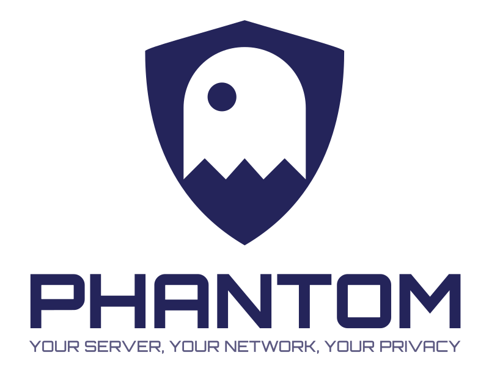
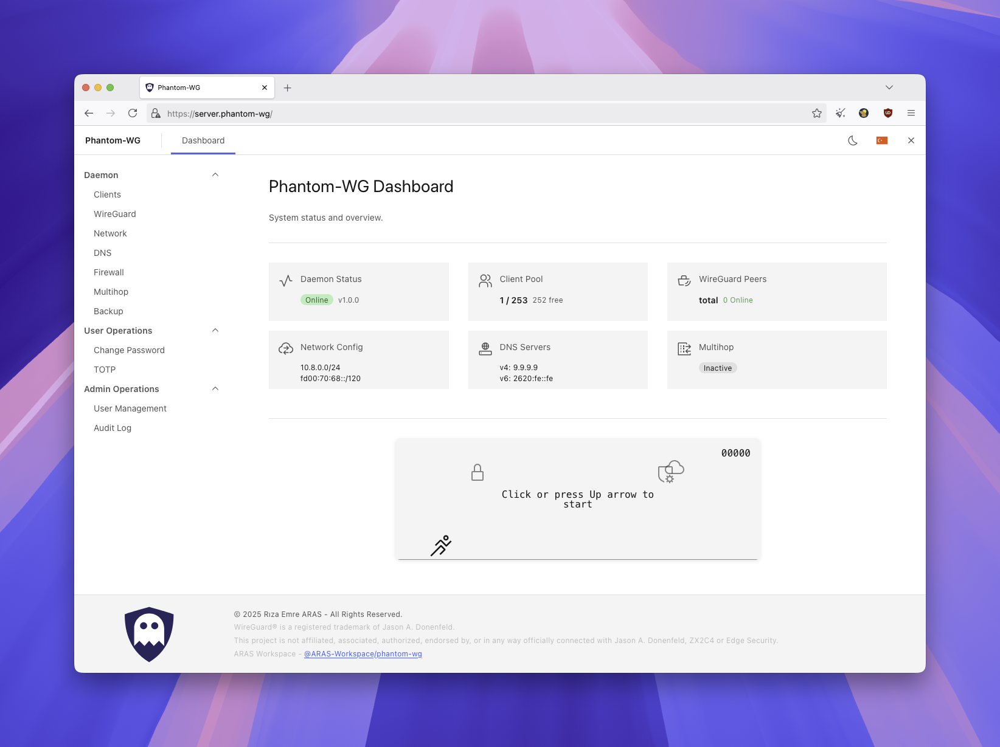
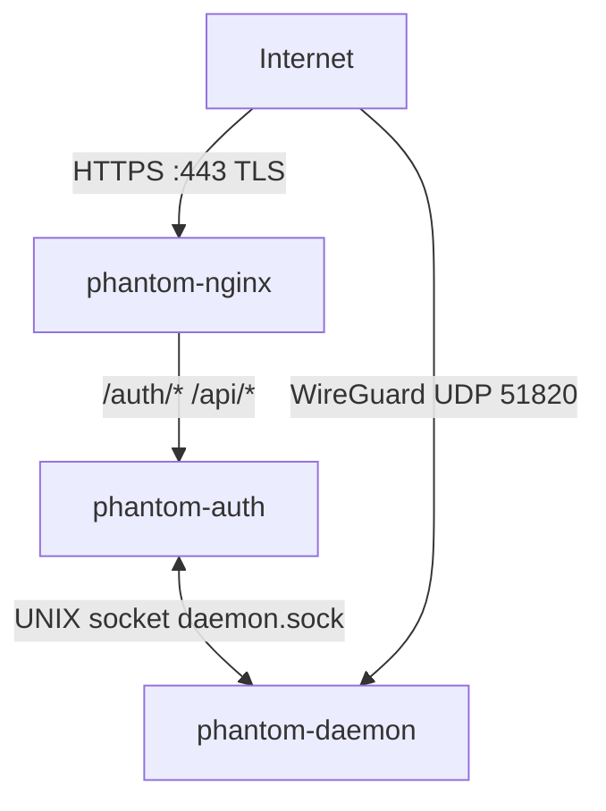
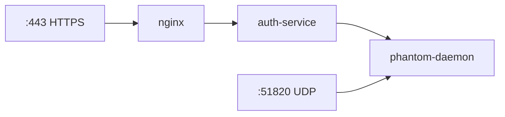
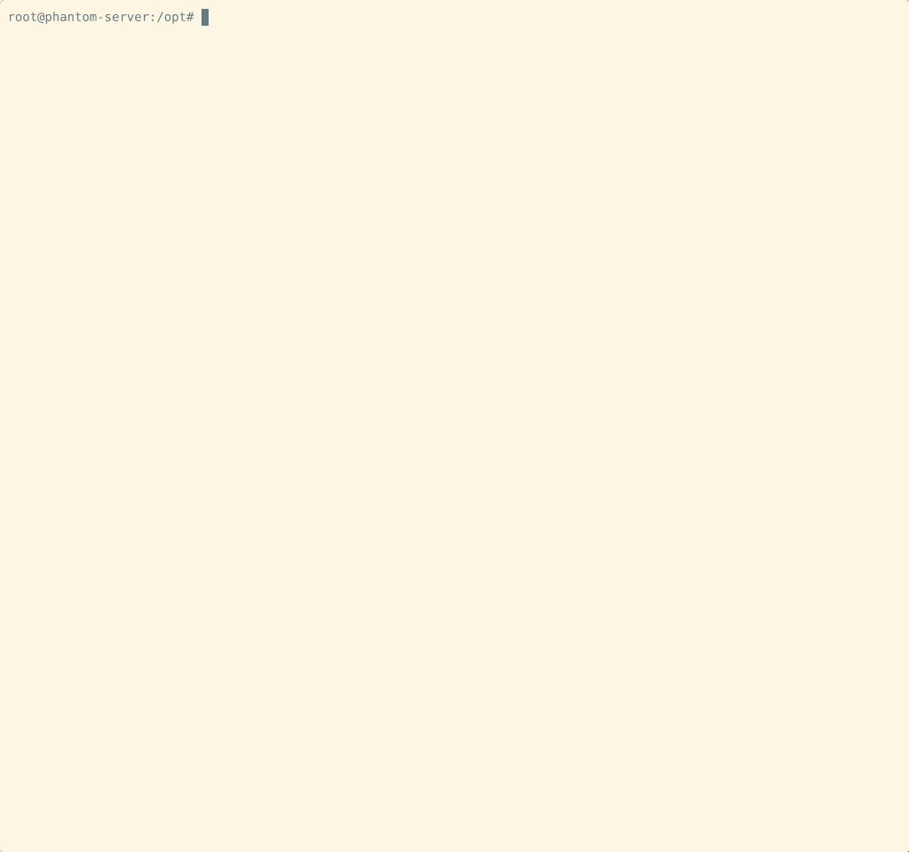

<div align="center">

<picture>
  <source media="(prefers-color-scheme: dark)" srcset="assets/phantom-vertical-master-stellar-silver.svg">
  <source media="(prefers-color-scheme: light)" srcset="assets/phantom-vertical-master-midnight-phantom.svg">
  
</picture>

[](https://github.com/ARAS-Workspace/phantom-wg/actions/runs/23315327358)
[](https://github.com/ARAS-Workspace/phantom-wg/releases/tag/v1.0.0)
[](LICENSE)
[](https://www.phantom.tc/docs)

<picture>
  <source media="(prefers-color-scheme: dark)" srcset="assets/dashboard-screenshot-dark.png">
  <source media="(prefers-color-scheme: light)" srcset="assets/dashboard-screenshot-light.png">
  
</picture>

</div>

> [!NOTE]
> Gelişmiş gizlilik özellikleri ve yalnızca sistem servisleri ile çalışan bir çözüm arıyorsanız [Phantom-WG Retro](https://github.com/ARAS-Workspace/phantom-wg/tree/retro) sürümü ilginizi çekebilir.

---

## Genel Bakış

***Phantom-WG Modern***, WireGuard® tabanlı bir VPN yönetim platformudur. Tüm bileşenler Docker container yapısı içerisinde çalışır ve asıl işi yapan Phantom Daemon Unix Domain Socket (UDS) üzerinden haberleşir.



Üretim Topolojisi, Docker Compose üzerinden yürütülen üç konteyner yapısından oluşur. Organizasyon üzerindeki yapının temel görevi sorguyu güvenli bir şekilde Daemon yapısına aktarmaktır.



---

## Kurulum

**Gereksinimler:** Docker Engine 20.10+, Docker Compose v2, bash.

```bash
curl -sSL get.phantom.tc | bash
```

<picture>
  <source media="(prefers-color-scheme: dark)" srcset="assets/phantom-wg-install-dark.gif">
  <source media="(prefers-color-scheme: light)" srcset="assets/phantom-wg-install-light.gif">
  
</picture>

### Yapılandırma

```bash
cd phantom-wg

# İlk kurulum (anahtarlar, auth DB, TLS sertifikası, env dosyaları)
./tools/prod.sh setup

# Endpoint yapılandırması
IPV4=$(curl -4 -sSL https://get.phantom.tc/ip)
IPV6=$(curl -6 -sSL https://get.phantom.tc/ip)
sed -i "s/^WIREGUARD_ENDPOINT_V4=.*/WIREGUARD_ENDPOINT_V4=${IPV4}/" .env.daemon
sed -i "s/^WIREGUARD_ENDPOINT_V6=.*/WIREGUARD_ENDPOINT_V6=${IPV6}/" .env.daemon

# Başlatma
./tools/prod.sh up
```

**Erişim:**
- Kontrol Paneli: `https://<sunucu-ip>`
- WireGuard: UDP port `51820`
- Admin şifresi: `cat container-data/secrets/production/.admin_password`

---

## Ortam Değişkenleri

Yapılandırma, kurulum sırasında şablonlardan oluşturulan iki env dosyası ile yönetilir:

| Dosya               | Servis         | Temel Ayarlar                                |
|---------------------|----------------|----------------------------------------------|
| `.env.daemon`       | phantom-daemon | WireGuard port, MTU, keepalive, endpoint IP  |
| `.env.auth-service` | phantom-auth   | JWT süresi, MFA zaman aşımı, hız sınırlaması |

Tüm seçenekler için `.example` dosyalarına bakın.

---

## Güncelleme

```bash
git pull
docker compose restart
```

Ortam değişkenleri güncellemeler boyunca korunur. `docker compose build` yalnızca bağımlılıklar değiştiğinde gereklidir.

---

## Mimari

| Bileşen            | Görev                                                                            |
|--------------------|----------------------------------------------------------------------------------|
| **phantom-nginx**  | TLS sonlandırma, SPA statik dosyalar, reverse proxy                              |
| **phantom-auth**   | JWT kimlik doğrulama, UDS üzerinden daemon'a API proxy                           |
| **phantom-daemon** | WireGuard arayüzleri, istemci yönetimi, güvenlik duvarı kuralları, veritabanları |

Detaylı mimari dokümantasyonu için [www.phantom.tc/docs/architecture](https://www.phantom.tc/docs/architecture) adresini ziyaret edin.

---

## Dokümantasyon

| Kaynak          | URL                                                                          |
|-----------------|------------------------------------------------------------------------------|
| Web Sitesi      | [www.phantom.tc](https://www.phantom.tc)                                     |
| Mimari          | [www.phantom.tc/docs/architecture](https://www.phantom.tc/docs/architecture) |
| API Referansı   | [www.phantom.tc/docs/api](https://www.phantom.tc/docs/api)                   |
| Kurulum Rehberi | [SETUP](SETUP)                                                               |

---

## Geliştirme

Aktif geliştirme [`dev/daemon`](https://github.com/ARAS-Workspace/phantom-wg/tree/dev/daemon) branch'inde yapılmaktadır. `main` branch'i yalnızca üretime hazır sürümleri içerir.

---

## Ticari Marka Bildirimi

WireGuard® Jason A. Donenfeld'in tescilli ticari markasıdır.

Bu proje; Jason A. Donenfeld, ZX2C4 veya Edge Security ile herhangi bir şekilde bağlantılı, ortaklı, yetkili veya onaylı değildir.

---

## Lisans

Telif Hakkı (c) 2025 Rıza Emre ARAS

[AGPL-3.0](LICENSE) lisansı altında lisanslanmıştır. Bağımlılık lisansları için [THIRD_PARTY_LICENSES](THIRD_PARTY_LICENSES) dosyasına bakın.
