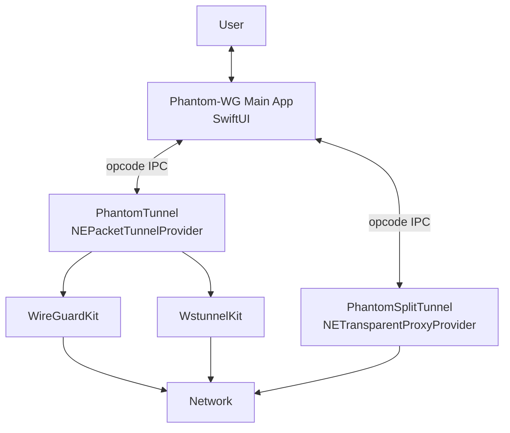

# Phantom-WG Mac — Engineering Handbook

Architectural documents describing the Phantom-WG Mac client, its two system extensions (PhantomTunnel + PhantomSplitTunnel), and the mechanics that bring them together.

These documents are retrospective, stable descriptions of mature architecture — not a change log. Individual decisions that alter the architecture are recorded in [Architecture Decision Records (ADRs)](../adr/en/0001-architectural-decision-records.md).

## Overview

## Technical Summary

Phantom-WG Mac is a two-extension NetworkExtension-based VPN client application:

- **PhantomTunnel** — `NEPacketTunnelProvider` that owns the `utun` interface and runs WireGuard (with optional wstunnel in Ghost Mode).
- **PhantomSplitTunnel** — `NETransparentProxyProvider` that routes selected applications' flows through a user-chosen physical interface instead of the tunnel.
- **Main App** — SwiftUI application that orchestrates both extensions, manages user configuration, and provides observability (logs) and control (reset, split-tunnel toggle).
- **Vendored dependencies** — [WireGuardKit fork](https://github.com/ARAS-Workspace/wireguard-apple) and [wstunnel fork](https://github.com/ARAS-Workspace/wstunnel), both under `ARAS-Workspace`.

## Documents

| Topic                   | 🇹🇷 Turkish                                | 🇬🇧 English |
|-------------------------|---------------------------------------------|--------------|
| **Tunnel Architecture** | [Turkish](./Turkish/Tunnel-Architecture.md) | *(pending)*  |
| **App Architecture**    | [Turkish](./Turkish/App-Architecture.md)    | *(pending)*  |

## Code Context

All code references in these documents point to commit [`d02e032`](https://github.com/ARAS-Workspace/phantom-wg/commit/d02e032) — the point where inline code comments were realigned with the codebase's actual behavior. Documents describe the architecture as-of that commit; subsequent code changes that alter the architecture are recorded in [ADRs](../adr).
