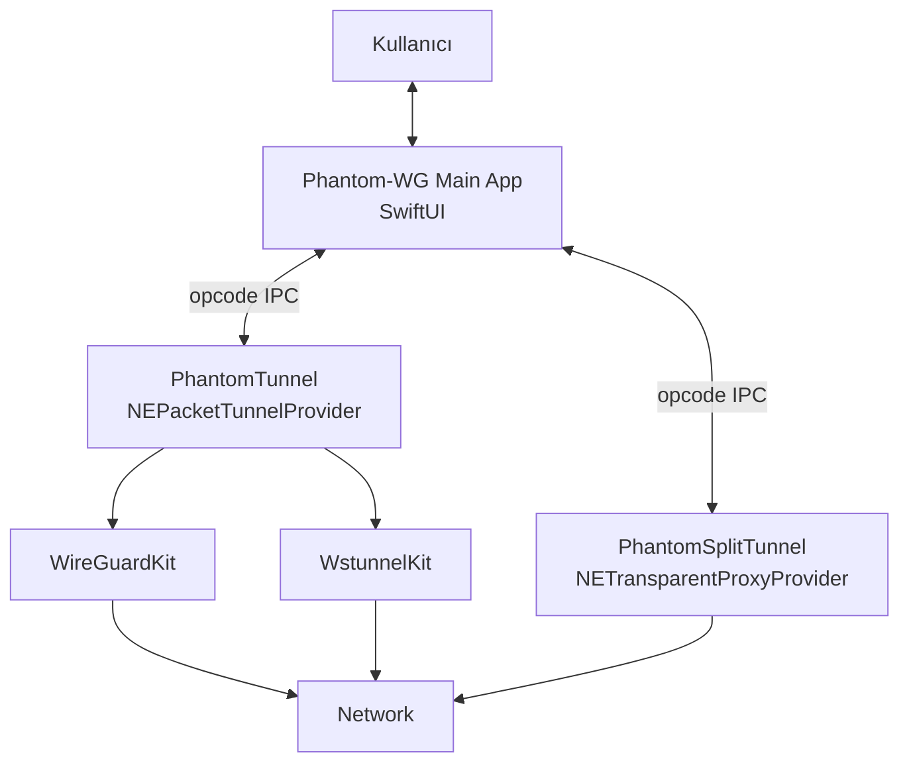

# Phantom-WG Mac — Mühendislik El Kitabı

Phantom-WG Mac istemcisini anlatan mimari belgeler, iki sistem uzantısı (PhantomTunnel + PhantomSplitTunnel) ve bu parçaları bir araya getiren mekanikler.

Bu belgeler bir değişim kaydı değil; olgun mimarinin retrospektif, değişmez tanımıdır. Mimariyi değiştiren bireysel kararlar [Mimari Karar Kayıtları (ADR)](../adr/tr/0001-architectural-decision-records.md) altında tutulur.

## Genel Bakış

## Teknik Özet

Phantom-WG Mac, iki uzantılı NetworkExtension tabanlı bir VPN istemci uygulamasıdır:

- **PhantomTunnel** — `utun` arayüzüne sahip olan ve WireGuard'ı çalıştıran `NEPacketTunnelProvider` (Ghost Mode'da opsiyonel wstunnel ile).
- **PhantomSplitTunnel** — Seçili uygulamaların akışlarını tünel yerine kullanıcının belirlediği fiziksel arayüze yönlendiren `NETransparentProxyProvider`.
- **Ana Uygulama** — Her iki uzantıyı orkestre eden, kullanıcı konfigürasyonunu yöneten ve gözlemlenebilirlik (loglar) + kontrol (sıfırlama, split-tunnel geçişi) sunan SwiftUI uygulaması.
- **Vendored bağımlılıklar** — [WireGuardKit fork](https://github.com/ARAS-Workspace/wireguard-apple) ve [wstunnel fork](https://github.com/ARAS-Workspace/wstunnel); her ikisi de `ARAS-Workspace` altındadır.

## Belgeler

| Konu                    | 🇹🇷 Türkçe                                | 🇬🇧 İngilizce |
|-------------------------|--------------------------------------------|----------------|
| **Tunnel Architecture** | [Türkçe](./Turkish/Tunnel-Architecture.md) | *(beklemede)*  |
| **App Architecture**    | [Türkçe](./Turkish/App-Architecture.md)    | *(beklemede)*  |

## Kod Bağlamı

Bu belgelerdeki tüm kod referansları [`d02e032`](https://github.com/ARAS-Workspace/phantom-wg/commit/d02e032) commit'ine işaret eder — inline kod yorumlarının kod tabanının gerçek davranışıyla hizalandığı nokta. Belgeler mimariyi bu commit itibarıyla anlatır; mimariyi değiştiren sonraki kod değişiklikleri [ADR'lar](../adr) altında kayıt altına alınır.
