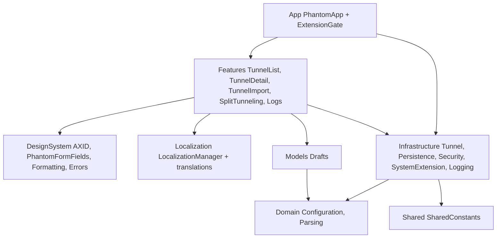
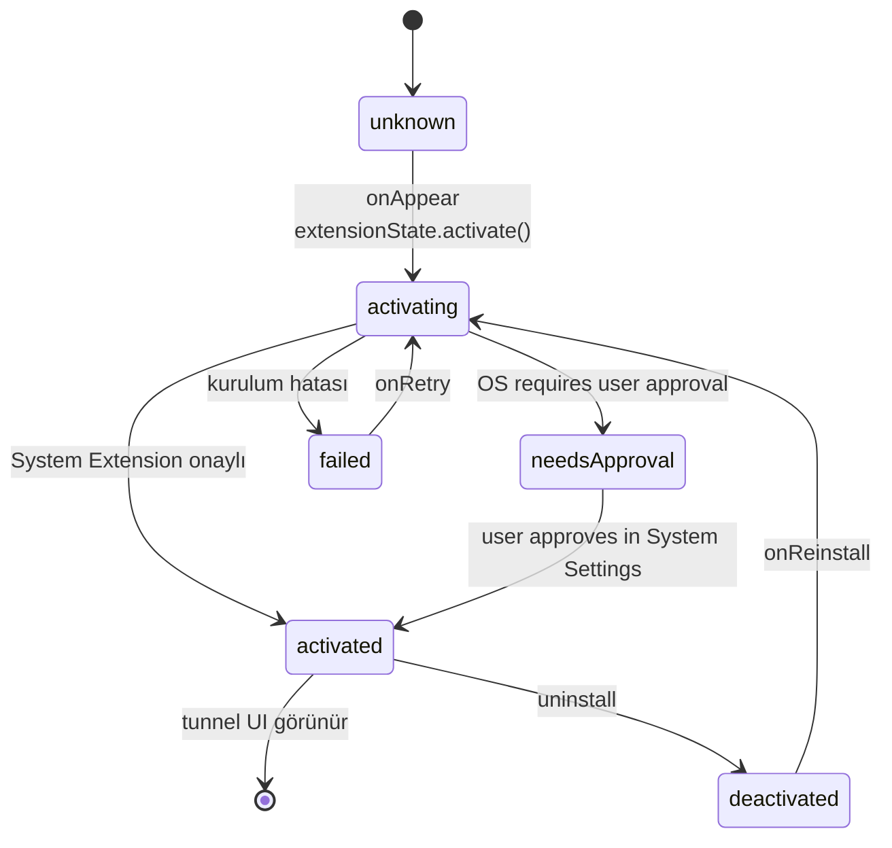
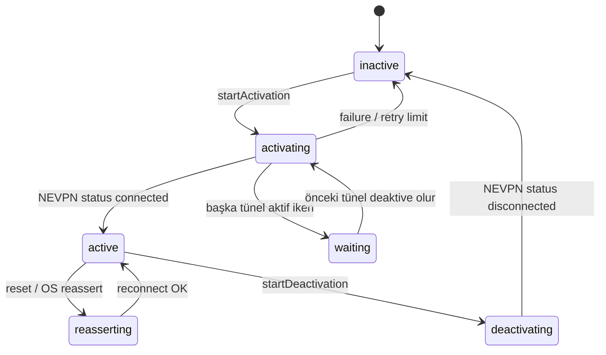
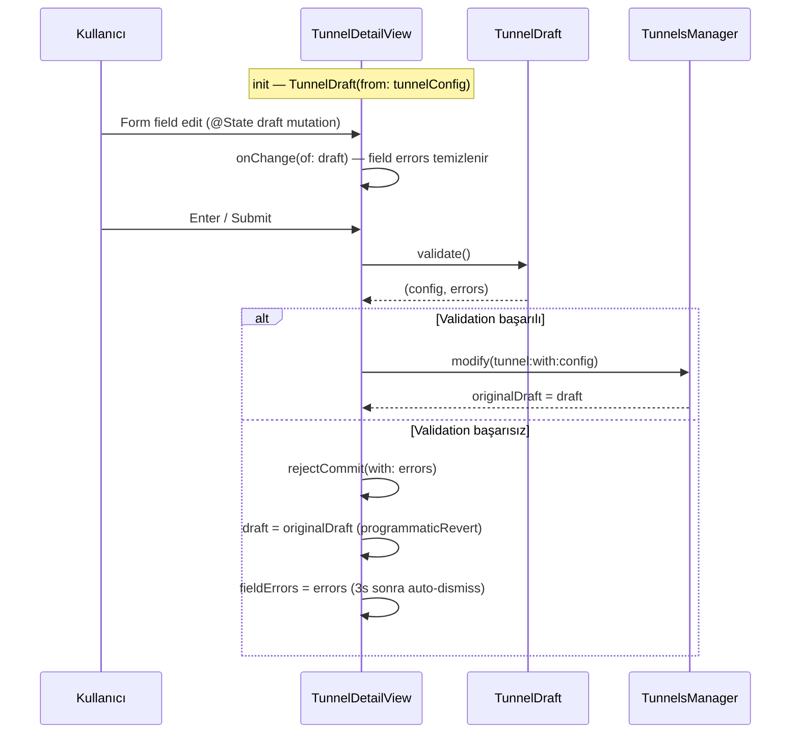
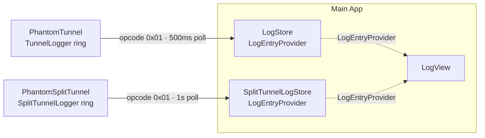

# App Architecture

## Bağlam

Phantom-WG Mac uygulaması iki sistem uzantısını (PhantomTunnel + PhantomSplitTunnel) içeren bir SwiftUI uygulamasıdır. Bu belge ana uygulamanın (main app) iç yapısını, durumu (state) nasıl yönettiğini ve iki uzantıyı kullanıcı deneyimi üzerinden nasıl yürüttüğünü kapsar.

Üç temel gereksinim ana uygulamanın şekillenmesini belirledi:

1. **Çoklu-Tünel Yönetimi.** Kullanıcı birden fazla tünel yapılandırması oluşturabilmeli, bunlar arasında geçiş yapabilmeli; tek aktif tünel disiplini otomatik olarak uygulanmalı.
2. **Canlı Durum Senkronizasyonu (state sync).** Tünel durumu, uzantı aktivasyon durumu, split-tunnel listesi değiştiğinde arayüz üzerinde (UI) anında güncellenmeli; kullanıcı yenileme (refresh) beklememeli, temel felsefe olarak kullanıcı interaktif kullanabilmeli ve ihtiyacına uygun stabil deneyim yaşamalı
3. **Özellikler Arası (Cross-Feature) tutarlılık.** Yerelleştirme (localization), erişilebilirlik (accessibility), doğrulama (validation), hata yönetimi (error handling), geri bildirim yüzeyleri (feedback surfaces) tüm özelliklerde aynı disiplini paylaşmalı.

SwiftUI ve Observation framework'ü (@Observable) bu gereksinimlerin temel taşıyıcısıdır. Uzantılar NE (NetworkExtension) framework'ü tarafından yönetilirken, ana uygulama kullanıcıya yakın, durum-yoğun (state-intensive) bir katmandır.

## Karar

Ana Uygulama (Main App), dokuz yapı taşı üzerine kurulmuştur.

### 1. Katmanlı Kaynak Organizasyonu



Kaynak ağacı tek yönlü bağımlılık disiplini üzerine kurulu: **App → Features → Infrastructure → Domain**; Features ayrıca **Models**'i (Drafts) kullanır ve Models Domain'e bağlıdır. DesignSystem, Localization ve Shared yatay olarak her katmandan kullanılabilir. Domain yalnızca standart kütüphaneye (Foundation, Network) bağımlıdır; Models domain tipleri üzerinden form/draft katmanı sağlar; Infrastructure NE framework'ü + Domain'i kullanır; Features SwiftUI + Infrastructure + Models'i kullanır.

Test edilebilirlik **protokol arayüzleri (protocol seams)** üzerinden kurulur: `TunnelProviding` [^7] NETunnelProviderManager'ı soyutlar, üretim (production) yolu `NETunnelProviderManager+TunnelProviding` üzerinden, test yolu `MockTunnelProvider` üzerinden gider. `LogEntryProvider` protokolü log kaynağını soyutlar. Bu ayrım Domain + Infrastructure kodunun birim testlerini NE framework'ü çalıştırmadan mümkün kılar.

### 2. State Management ve Observation

Ana uygulama tamamen Swift'in Observation framework'ü (`@Observable` macro, iOS 17+/macOS 14+) üzerine kuruludur. Ana pattern'ler:

- **`@Observable`**: durum nesneleri (managers, stores, containers) — SwiftUI view'leri bu nesnelerin herhangi bir property'si değiştiğinde otomatik re-render olur.
- **`@MainActor`**: arayüz-bağlı durum için main-thread izolasyonu — `TunnelsManager`, `TunnelsManagerLoader`, `LocalizationManager`, `SplitTunnelExtensionState` ve diğer arayüz-tarafı sınıflar buraya takılır.
- **`@Environment`**: PhantomApp [^1] root'ta 8 manager/store'u `.environment(...)` modifier'larıyla enjekte eder; descendant view'lar `@Environment(ManagerType.self)` ile bunları okur — property drilling gerekmez.
- **`@ObservationIgnored`**: observation kapsamı dışında tutulması gereken internal bookkeeping durumları (activation attempt IDs, retry task'ları, delegate token'ları).

Yaşam döngüsü pattern'i üç kategori:
- **Manager** (TunnelsManager, SplitTunnelProviderManager, SystemExtensionState) — dış sistemleri (NE framework, OSSystemExtensionManager) wrap eden ve durum observer'ları tutan sınıflar.
- **Store** (SplitTunnelingStore) — kalıcı durumun in-memory kaynağı; load/save disiplini içerir.
- **Container** (TunnelContainer [^6]) — tekil bir domain nesnesinin runtime durumunu tutan ince sarmalayıcı; `id`, `status`, `lastActivationError` gibi arayüz-gözlemlenebilir değerler + `@ObservationIgnored` activation bookkeeping.

### 3. Extension Gate Pattern

Ana tünel uzantısı (PhantomTunnel) app'in **çalışma ön-koşuludur**. Kullanıcı ilk kurulumda uzantıyı onaylamadan tünel arayüzüne geçemez. PhantomApp [^1] bu zorunluluğu bir **gate** ile uygular:



Gate `extensionState.status` üzerinden switch eder [^2]:
- `unknown` / `activating` → `ActivatingView` (spinner)
- `needsApproval` → `ApprovalView` (System Settings yönlendirme + re-check butonu)
- `activated` → `TunnelContentView(loader: tunnelsManager)` — tünel listesi arayüzü
- `deactivated` → `DeactivatedView` (reinstall CTA)
- `failed(message)` → `FailedView` (hata mesajı + retry)

**Split-tunnel uzantısı opt-in**: main tunnel gate'inden bağımsız — kullanıcı Split-Tunneling sheet'inden kendi rızasıyla yükler ve tunnel'ı etkilemeden kaldırabilir. `SplitTunnelExtensionState` [^3] ayrı lifecycle tutar, `SystemExtensionState` ile aynı API şeklini paylaşır (activate/deactivate + delegate + status polling) ama bundle ID'si `com.remrearas.Phantom-WG-MacOS.PhantomSplitTunnel`'dır.

### 4. Tunnel Orchestration

Kullanıcının tünel yapılandırmalarını tutan, yaşam döngülerini yöneten, NE framework'ü ile konuşan merkezi sınıf `TunnelsManager` [^5]'dir. İki kademeli yükleme yapılır:

**Loader + Manager bölünmesi.** `TunnelsManager.create()` async'tir (NE framework'ünden `loadAllFromPreferences` çağrısı yapar), ama `@Observable init` async olamaz. Bu asenkronluk boşluğunu `TunnelsManagerLoader` [^4] doldurur: `@Observable` thin wrapper, `manager: TunnelsManager?` optional property'si + `loadError: String?` + async `load()` metodu. PhantomApp root'ta Loader'ı inject eder; TunnelContentView `.task { await loader.load() }` ile doldurur.

**CRUD lifecycle.** `add(config:)` / `modify(tunnel:with:)` / `remove(tunnel:)` metotları NETunnelProviderManager üretir, yapılandırır, `savePreferences()` + `loadPreferences()` ikilisinden geçirir. Config değişiklikleri `NEVPNConfigurationChange` observer'ı tarafından yakalanır, liste otomatik reload edilir.

**Aktivasyon durum makinesi.**



`startActivation(of:)` tek aktif tünel invariant'ını uygular — başka bir tünel aktifse, yeni tünel `.waiting` durumuna alınır, önceki tünel `startDeactivation` ile durdurulur, deaktivasyon tamamlanınca waiting olan aktive edilir. Retry mekaniği: `maxRetries = 8` deneme, aralarında `retryInterval = 5s` bekleme; başarısızlıkta `lastActivationError` set edilir ve durum makinesi `.inactive`'e düşer.

**Durum izleme.** `NEVPNStatusDidChange` observer'ı her tünel için `handleStatusChange` çağırır; bu metot OS-tarafı `NEVPNStatus`'u app-tarafı `TunnelStatus` [^15] enum'una eşler. `waitingTunnel` alanı aktivasyon kuyruğunu tutar.

### 5. Split-Tunnel Orchestration

Split-tunnel üç işbirlikçi arasında dağıtılır:

- **`SplitTunnelingStore`** [^10] — kullanıcı config'inin main-app tarafındaki kaynağı. `split-tunneling.json` App Group dosyasını okur/yazar; her mutation `providerManager.reloadExtensionConfig` tetikler (session açıksa opcode `0x00` gönderir, kapalıysa no-op — sonraki `startProxy`'de providerConfiguration'dan okunur).
- **`SplitTunnelProviderManager`** [^9] — `NETransparentProxyManager` wrapper'ı. Preference entry lifecycle (load/save/remove), session enable/disable, opcode 0x00/0x01/0x02 mesaj wrapper'ları (`reloadExtensionConfig`, `fetchLogs`, `clearLogs`).
- **`SplitTunnelExtensionState`** [^3] — System Extension install/deactivate lifecycle (OSSystemExtensionRequestDelegate).

**Reconciliation akışı.** PhantomApp root'ta iki trigger'a bağlı `reconcileSplitSession` fonksiyonu var:

```swift
.onChange(of: splitTunnelingStore.configuration.isEnabled) { _, _ in reconcileSplitSession() }
.onChange(of: splitExtensionState.status) { _, _ in reconcileSplitSession() }
```

Fonksiyon iki koşulu değerlendirir — `isEnabled` ve `extension status == .activated` — ve `shouldRun` kararı ile `sessionStatus`'un beklenen eşleşmesine göre `enable(with:)` veya `disable()` çağırır. Bu merkezi reconciler sayesinde kullanıcı toggle'ları, extension aktivasyon/deaktivasyon olayları ve oturum durumu tutarlı tutulur.

**Main tunnel'dan bağımsızlık.** Split-tunnel reconciliation `extensionState` (main tunnel) değil, `splitExtensionState` üzerinden çalışır. Main tunnel çalışmasa bile split-tunnel opt-in olarak ayakta kalabilir — ancak bu UX olarak anlamsız bir durum, main tunnel olmadan bypass edilecek bir akış yoktur.

### 6. Draft / Validation Pattern

Kullanıcı yapılandırma düzenlemelerini **Draft ↔ Config** döngüsüyle yönetiriz [^11]:



**Invariant'lar:**
- Düzenleme yalnızca `tunnel.status == .inactive` iken izinlidir (aktif tünel config'i değişmez).
- `originalDraft` son commit edilmiş snapshot'tır; `draft` anlık kullanıcı girdisidir.
- Validation hatası durumunda draft `originalDraft`'e revert edilir — kullanıcı bilinen-iyi değere geri döner.
- `programmaticRevert` flag'i `onChange(of: draft)` içindeki otomatik error clear'ı baypas eder; revert sırasında error banner kaybolmaz.

Field error taksonomisi: `FieldValidationError` (empty, nameAlreadyExists, format geçersiz vb.) + `TunnelDraft.Field` enum'u (name, privateKey, addresses, ...) birlikte `[Field: FieldValidationError]` dict'inde arayüze taşınır; her field kendi error mesajını inline gösterir.

### 7. UI Compose Patterns

SwiftUI view hiyerarşisi feature bazlı organize edilmiş: her feature kendi `Sections/`, `Components/` alt dizinlerine sahip (örn. `TunnelDetail/Sections/NameSection.swift`, `TunnelDetail/Sections/PeerSection.swift`). Bu parçalama view complexity'sini makul tutar ve aynı section'ın test/preview edilmesini kolaylaştırır.

**Geri bildirim yüzeyi (feedback surface) disiplini:**

| Surface                 | Kullanım                                            | Örnek                                |
|-------------------------|-----------------------------------------------------|--------------------------------------|
| **Toast** (ToastCenter) | Transient success/info mesajları (3s auto-dismiss)  | "Tünel eklendi", "Config kopyalandı" |
| **Alert**               | Hata onayı, destructive confirmation                | Tünel silme onayı, activation error  |
| **Sheet**               | Modal özellik sunucu (import, split-tunneling, log) | TunnelImport, SplitTunnelingView     |
| **Inline Error Banner** | Alan doğrulama hataları (3s auto-dismiss)           | Draft reject mesajları               |

**Accessibility identifier disiplini.** `AXID` [^14] enum'u dot-separated/kebab-case konvansiyonu uygular: `<feature>.<sub-feature>.<element>[.<variant>]`. Örnek: `tunnel-detail.actions.reset-button`, `log-view.clear-button`. UI testleri bunları tek sorgu yüzeyi olarak kullanır; string değişiklikleri breaking change sayılır.

**Copy feedback timer pattern.** Copy butonları tıklama sonrası 2s boyunca "Kopyalandı!" state'ine geçer (local `@State` + Task.sleep); aynı id için tekrar kopyalarsa timer yeniden başlar — basit ama dengeli geri bildirim.

### 8. Localization

`LocalizationManager` [^13] singleton `@Observable` sınıfıdır. Üç tasarım kararı:

1. **Runtime dil değişimi.** Language enum (`.tr`, `.en`) — kullanıcı dil butonunu çevirdiğinde `current` property'si değişir, didSet blokta UserDefaults'a kayıt + `loadStrings()` tekrar çağrılır. `strings: [String: String]` dict'i `@Observable`'ın parçası olduğundan, dict reassign her `t(_:)` tüketicisini re-render tetikler. Bu anahtar detay: eğer `strings` `@ObservationIgnored` olsaydı dil değişimi view'lara ulaşmazdı.

2. **Fallback zinciri.** Başlangıçta dil çözümü: `UserDefaults["app_language"]` → `Locale.current.language.languageCode == "tr"` → `.en`. Kullanıcı tercihine saygı, sistem tercihi yedek, İngilizce son çare.

3. **Format arg variant.** `t(_:_:)` method'u `CVarArg` varargs ile `%d`/`%@` formatlı mesajları destekler (örn. `t("error_retry", 8, "timeout")` → `"Retry 8 failed: timeout"`).

Translation dosyaları `Localization/translations/tr.json` + `en.json` olarak bundle'a gömülü gelir; `loadStrings()` Bundle'dan dilin JSON'unu okur ve dict'e yükler.

### 9. Observability Bridge

Extension-tarafı ring buffer'ları (TunnelLogger + SplitTunnelLogger, her iki uzantı process'inde tutulan in-memory log kaynakları) ana uygulama arayüzüne `LogStore` [^12] üzerinden köprülenir. Tek arayüz iki kaynağı besler:



`LogEntryProvider` protokolü `var entries: [LogEntry]`, `startPolling()`, `stopPolling()`, `clear() async` kontratıyla `LogView`'a hangi store'un feed ettiğini anlamadan aynı render yolunu verir. `LogStore` tunnel extension'a (opcode `0x01`, JSON decode), `SplitTunnelLogStore` split-tunnel extension'a (opcode `0x01`, UTF-8 string parse) özeldir ama view'da aynı LogView'u besler.

**Oturum-özel yapı.** Log'lar extension process'inde yaşar ve uzantı tarafından her yeni session başında (`startTunnel` / `startProxy`) sıfırlanır. Ana uygulama kendi tarafında persistent log tutmaz; polling aktif tünel sürdüğü sürece devam eder, tünel kapanınca LogStore `.entries` boşaltır. Clear mekaniği opcode 0x02 gönderir — extension ring buffer + ana uygulamadaki entries eş zamanlı temizlenir.

## Sonuçlar

- Extension Gate pattern app boot'u iki aşamaya böler: önce ana tünel uzantısının aktivasyonunu bekle, sonra tünel arayüzünü aç. Kullanıcı olmayan bir özelliğe yanlışlıkla erişemez.
- PhantomApp root'ta 8 `@State` manager bir arada durur; `@Environment` injection sayesinde descendant view'lar sadece ihtiyaç duydukları manager'ı okur.
- TunnelsManagerLoader + TunnelsManager ikilisi async init boşluğunu temiz kapatır; SwiftUI'nin `@Observable` init sınırlamasını wrap layer ile çözer.
- Split-tunnel ana tünelden bağımsız lifecycle tutar; iki uzantı ayrı ayrı yüklenip kaldırılabilir.
- Draft/Commit pattern kullanıcı edit'ini doğrulamadan geçirir; doğrulama hatası draft'ı known-good'a revert eder, kullanıcı hiçbir zaman yarı-geçerli durumda kalmaz.
- Özellik-bazlı view parçalama (Sections/Components) SwiftUI view hierarchy'sini linear tutar; her parça kendi yerelleştirme/erişilebilirlik/alan doğrulamasını kendi kapsamında uygular.
- LocalizationManager runtime dil değişimini tüm arayüze yansıtır — `strings` dict'i `@Observable`'ın parçası olduğu için.
- TunnelProviding protocol seam'i unit testleri NE framework'sunden izole eder.
- LogEntryProvider protokolü iki farklı ring buffer kaynağını tek LogView'a servis eder; wire format farklılığı (JSON vs UTF-8 string) soyutlanır.

## Referanslar

Aşağıdaki dosya yolları Phantom-WG Mac deposundaki `d02e032` commit'inde yer alır — bu commit inline kod yorumlarının kod gerçeğiyle hizalandığı noktadır. Bu belge mimariyi bu commit itibarıyla tarif eder; belgenin kendisi güncellendiğinde commit bağlamı da hizalı biçimde bir sonraki referans noktasına taşınır.

[^1]: [`Phantom-WG-MacOS/App/PhantomApp.swift`](https://github.com/ARAS-Workspace/phantom-wg/blob/d02e032/Phantom-WG-MacOS/App/PhantomApp.swift) — App entry, 8 `@State` manager/store, Extension Gate switch, split-tunnel reconciliation

[^2]: [`Phantom-WG-MacOS/Infrastructure/SystemExtension/SystemExtensionState.swift`](https://github.com/ARAS-Workspace/phantom-wg/blob/d02e032/Phantom-WG-MacOS/Infrastructure/SystemExtension/SystemExtensionState.swift) — Main tunnel extension lifecycle (OSSystemExtensionRequestDelegate)

[^3]: [`Phantom-WG-MacOS/Infrastructure/SystemExtension/SplitTunnelExtensionState.swift`](https://github.com/ARAS-Workspace/phantom-wg/blob/d02e032/Phantom-WG-MacOS/Infrastructure/SystemExtension/SplitTunnelExtensionState.swift) — Split-tunnel extension lifecycle + approval polling + error code mapping

[^4]: [`Phantom-WG-MacOS/Infrastructure/Tunnel/TunnelsManagerLoader.swift`](https://github.com/ARAS-Workspace/phantom-wg/blob/d02e032/Phantom-WG-MacOS/Infrastructure/Tunnel/TunnelsManagerLoader.swift) — TunnelsManager async init için thin `@Observable` wrapper

[^5]: [`Phantom-WG-MacOS/Infrastructure/Tunnel/TunnelsManager.swift`](https://github.com/ARAS-Workspace/phantom-wg/blob/d02e032/Phantom-WG-MacOS/Infrastructure/Tunnel/TunnelsManager.swift) — Tünel CRUD, aktivasyon durum makinesi, retry mekaniği, NEVPN notification observer'ları; aynı dizinde `TunnelsManager+Activation.swift` (aktivasyon + reset mekaniği)

[^6]: [`Phantom-WG-MacOS/Infrastructure/Tunnel/TunnelContainer.swift`](https://github.com/ARAS-Workspace/phantom-wg/blob/d02e032/Phantom-WG-MacOS/Infrastructure/Tunnel/TunnelContainer.swift) — Tünel durum sarmalayıcı (+ `@ObservationIgnored` activation bookkeeping)

[^7]: [`Phantom-WG-MacOS/Infrastructure/Tunnel/TunnelProviding.swift`](https://github.com/ARAS-Workspace/phantom-wg/blob/d02e032/Phantom-WG-MacOS/Infrastructure/Tunnel/TunnelProviding.swift) — NETunnelProviderManager abstraction; production bağlayıcı `NETunnelProviderManager+TunnelProviding.swift` aynı dizinde

[^8]: [`Phantom-WG-MacOS/Infrastructure/Tunnel/TunnelProviderFactory.swift`](https://github.com/ARAS-Workspace/phantom-wg/blob/d02e032/Phantom-WG-MacOS/Infrastructure/Tunnel/TunnelProviderFactory.swift) — Provider factory abstraction for dependency injection

[^9]: [`Phantom-WG-MacOS/Infrastructure/Tunnel/SplitTunnelProviderManager.swift`](https://github.com/ARAS-Workspace/phantom-wg/blob/d02e032/Phantom-WG-MacOS/Infrastructure/Tunnel/SplitTunnelProviderManager.swift) — NETransparentProxyManager wrapper + opcode mesaj yöntemleri

[^10]: [`Phantom-WG-MacOS/Infrastructure/Persistence/SplitTunnelingStore.swift`](https://github.com/ARAS-Workspace/phantom-wg/blob/d02e032/Phantom-WG-MacOS/Infrastructure/Persistence/SplitTunnelingStore.swift) — `split-tunneling.json` persistence + live reload trigger

[^11]: [`Phantom-WG-MacOS/Models/Drafts/TunnelDrafts.swift`](https://github.com/ARAS-Workspace/phantom-wg/blob/d02e032/Phantom-WG-MacOS/Models/Drafts/TunnelDrafts.swift) — `TunnelDraft` + `Field` enum + `validate()`

[^12]: [`Phantom-WG-MacOS/Features/Logs/LogStore.swift`](https://github.com/ARAS-Workspace/phantom-wg/blob/d02e032/Phantom-WG-MacOS/Features/Logs/LogStore.swift) — PhantomTunnel log bridge (+ `LogEntryProvider` protocol tanımı); split-tunnel karşılığı [`Phantom-WG-MacOS/Infrastructure/Logging/SplitTunnelLogStore.swift`](https://github.com/ARAS-Workspace/phantom-wg/blob/d02e032/Phantom-WG-MacOS/Infrastructure/Logging/SplitTunnelLogStore.swift)

[^13]: [`Phantom-WG-MacOS/Localization/LocalizationManager.swift`](https://github.com/ARAS-Workspace/phantom-wg/blob/d02e032/Phantom-WG-MacOS/Localization/LocalizationManager.swift) — TR/EN runtime toggle + JSON translation loader

[^14]: [`Phantom-WG-MacOS/DesignSystem/Accessibility/AXID.swift`](https://github.com/ARAS-Workspace/phantom-wg/blob/d02e032/Phantom-WG-MacOS/DesignSystem/Accessibility/AXID.swift) — Accessibility identifier konvansiyonu (UI test sorgu yüzeyi)

[^15]: [`Phantom-WG-MacOS/Infrastructure/Tunnel/TunnelStatus.swift`](https://github.com/ARAS-Workspace/phantom-wg/blob/d02e032/Phantom-WG-MacOS/Infrastructure/Tunnel/TunnelStatus.swift) — `NEVPNStatus` → `TunnelStatus` enum mapping + `TunnelStatus+UI.swift` UI eklemeleri

---

## Sözlük

Belge boyunca geçen İngilizce terimlerin Türkçe karşılıkları. İlk kullanımda Türkçe terim + İngilizce parantez içinde verilir (örn. *ana uygulama (main app)*), sonraki kullanımlarda yalnızca Türkçe. Marka/API/ürün adları (SwiftUI, PhantomTunnel, NetworkExtension, @Observable vb.) çevrilmez.

| İngilizce        | Türkçe                | Bağlam                                                                                                                 |
|------------------|-----------------------|------------------------------------------------------------------------------------------------------------------------|
| main app         | ana uygulama          | Uygulamanın ana süreci (uzantılardan ayrı olan)                                                                        |
| state            | durum                 | Bir nesnenin veya sistemin o anki veri/durum bilgisi                                                                   |
| state sync       | durum senkronizasyonu | Durumun farklı katmanlar arasında tutarlı tutulması                                                                    |
| state-intensive  | durum-yoğun           | Çok fazla durum izleyen/yöneten sınıf veya katman                                                                      |
| UI               | arayüz                | Kullanıcı arayüzü (User Interface)                                                                                     |
| refresh          | yenileme              | Veriyi/görüntüyü tekrar yükleme                                                                                        |
| cross-feature    | özellikler arası      | Birden fazla özelliği etkileyen, yatay kesen                                                                           |
| localization     | yerelleştirme         | Dil ve bölgeye uyarlama                                                                                                |
| accessibility    | erişilebilirlik       | Engelli kullanıcılar ve yardımcı teknolojiler için erişim katmanı                                                      |
| validation       | doğrulama             | Kullanıcı girdisinin geçerliliğinin denetlenmesi                                                                       |
| error handling   | hata yönetimi         | Hata yakalama ve kullanıcıya anlamlı mesajla gösterme                                                                  |
| feedback surface | geri bildirim yüzeyi  | Kullanıcıya bilgi/uyarı veren arayüz bileşeni (toast, alert, banner vb.)                                               |
| feature          | özellik               | Uygulamanın bir işlev/modül parçası                                                                                    |
| protocol seam    | protokol arayüzü      | Farklı gerçekleşmeleri (üretim/mock) enjekte edebilmek için tanımlanan protokol sınırı; test edilebilirlik için kritik |
| production       | üretim                | Canlı/yayın ortamında çalışan gerçekleşme (test karşıtı)                                                               |
