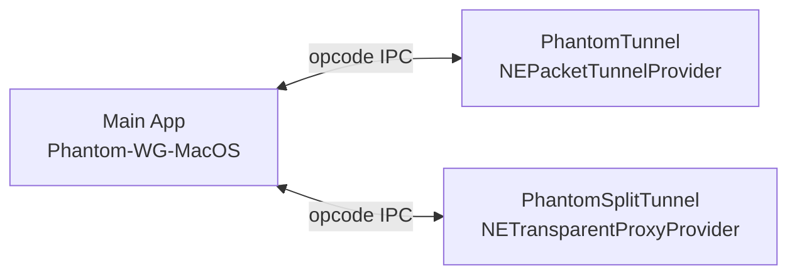
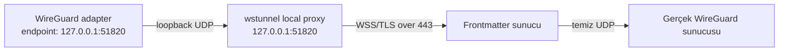
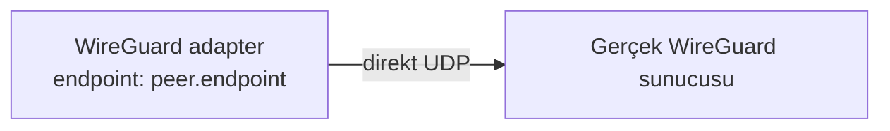
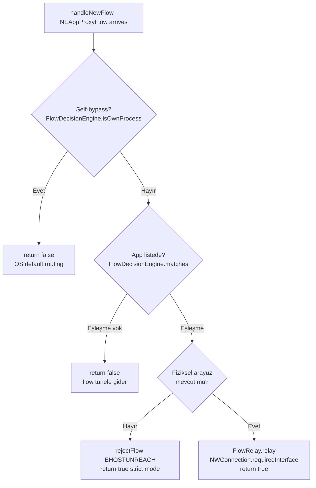
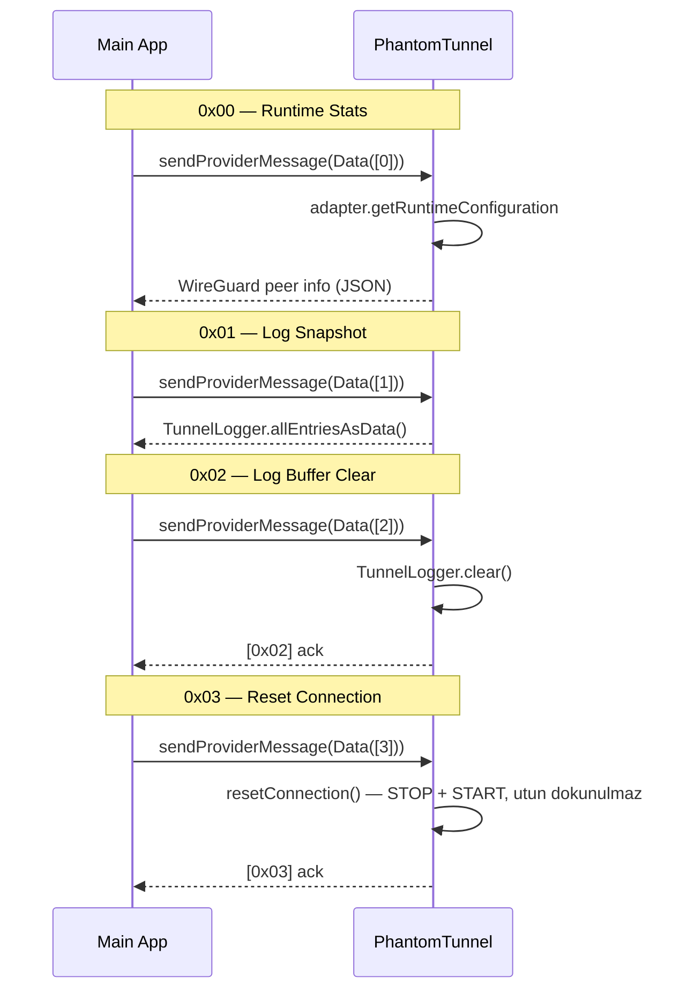
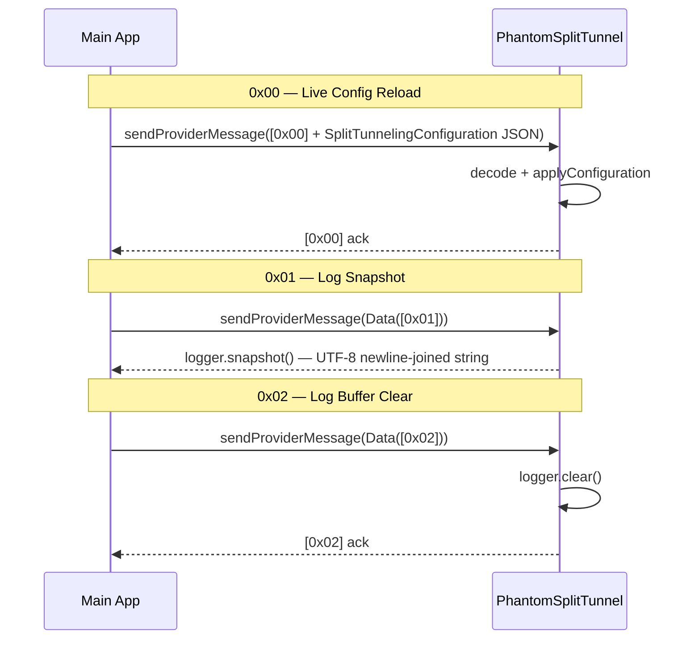
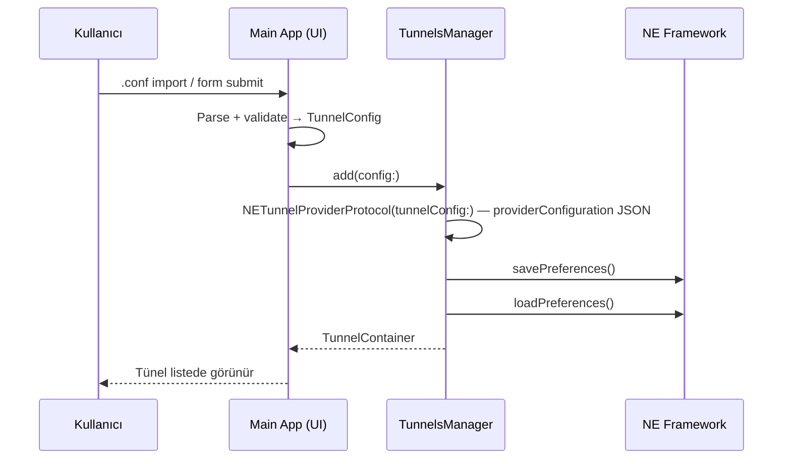
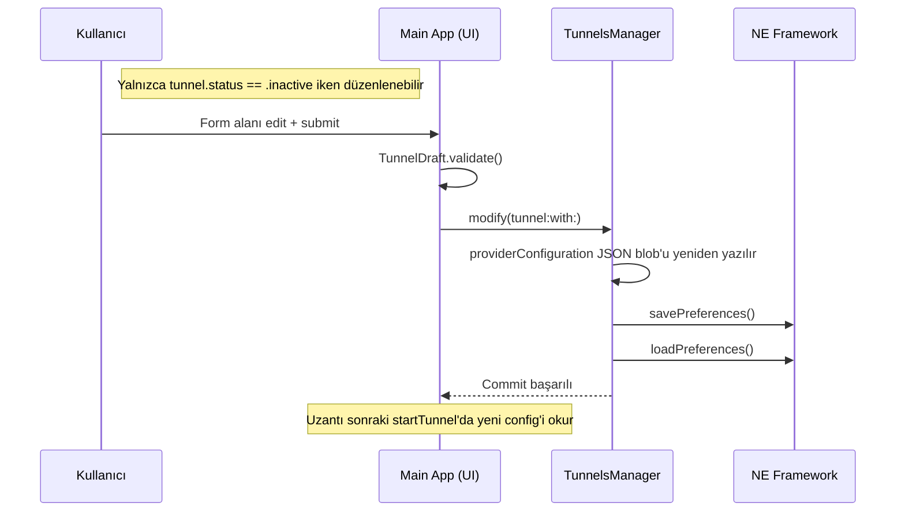
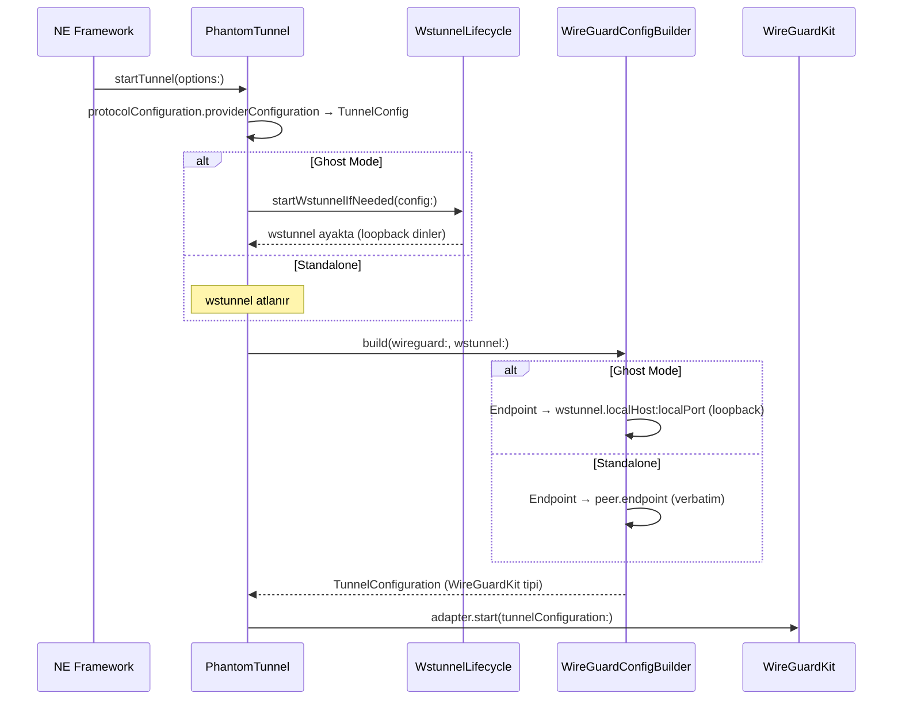

# Tunnel Architecture

## Bağlam

Phantom-WG Mac istemcisinin üç temel gereksinimi var:

1. **Sansüre dirençli VPN bağlantısı.** Düz WireGuard UDP trafiği DPI katmanında tanınır ve engellenir; kullanıcı bu senaryoda da bağlanabilmeli.
2. **Uygulama Bazlı Routing.** Kullanıcı seçimine bağlı olarak belirli uygulamaların tünelden değil fiziksel arayüzden çıkması.
3. **Sızıntısız Yeniden Bağlanma.** Tünel takıldığında `utun` arayüzünü yok etmeden içindeki akış yeniden kurulabilmeli.

Apple NetworkExtension framework'ü bu üç gereksinimi tek bir uzantı tipinde karşılamaz. `NEPacketTunnelProvider` paket tünelini yönetir ama uygulama bazlı routing vermez; `NETransparentProxyProvider` flow interception yapar ama paket tüneli kuramaz.

> **Not:** Ghost Mode yalnızca istemci tarafı bir katman değildir; karşı uçta wstunnel trafiğini karşılayıp arkasındaki WireGuard sunucusuna yönlendiren bir entry-point servisinin konfigüre edilmiş olması gerekir. Referans sunucu tarafı kurulumu için [Phantom-WG Frontmatter](https://github.com/ARAS-Workspace/phantom-wg/tree/frontmatter) kullanılabilir.

## Karar

Tünel mimarisi dokuz yapı taşı üzerine kuruldu.

### 1. Sistem Uzantısı Mimarisi (System Extension Architecture)

Phantom-WG Mac istemcisi iki ayrı sistem uzantısı (System Extension) üzerine kurulu. Uzantılar birbirine bağımlı değil, paralel çalışır. PhantomTunnel tek başına çalıştığında tüm sistem trafiği tünelden akar — klasik VPN davranışı. PhantomSplitTunnel opt-in olarak etkinleştirildiğinde bu varsayılan bozulur: kullanıcının seçtiği uygulamaların TCP/UDP akışları yakalanır ve fiziksel arayüze (`en0` ya da seçilen başka bir arayüz) yönlendirilir — sanki o uygulamaya internet kablosu tekrar takılmış gibi, VPN'den bağımsız olarak dışarı çıkar. Geri kalan tüm sistem trafiği tünelde kalır.

Main app her iki uzantıyla **bağımsız IPC kanalları** üzerinden haberleşir. İstek `sendProviderMessage(Data, responseHandler:)` [^7] çağrısıyla uzantının session referansına gönderilir, uzantı tarafında `handleAppMessage(_, completionHandler:)` opcode'a göre dispatch eder ve yanıt `completionHandler` üzerinden döner. İki uzantıya aynı anda paralel istek mümkündür; opcode uzayları ayrıktır (bkz. Madde 7).

#### PhantomTunnel

- **Tip:** `NEPacketTunnelProvider` — paket-düzeyi VPN uzantısı.
- **Sorumluluk:** `utun` arayüzünü oluşturmak, sistem trafiğini yakalamak, WireGuard ve (Ghost Mode'da) wstunnel lifecycle'larını yönetmek.
- **Mode seçimi:** `TunnelConfig.isGhostMode` [^5] sinyaliyle Ghost ya da Standalone kolu yürütülür.
- **Ana API:** `startTunnel`, `stopTunnel`, `handleAppMessage` [^1] (opcode kontratı Madde 7'de).

#### PhantomSplitTunnel

- **Tip:** `NETransparentProxyProvider` — akış-düzeyi uygulama proxy uzantısı.
- **Sorumluluk:** kullanıcının seçtiği uygulamaların TCP/UDP akışlarını `handleNewFlow` [^3] ile yakalamak ve fiziksel arayüze (`en0` ya da seçilen başka bir arayüz) yönlendirmek.
- **Live config reload:** kullanıcı uygulama listesini değiştirdiğinde opcode `0x00` ile uzantıya yeni config inject edilir; uzantı yeniden başlatılmaz.
- **Ana API:** `startProxy`, `stopProxy`, `handleNewFlow`, `handleAppMessage`.

### 2. Ghost Mode katman kompozisyonu

WireGuard endpoint'in gerçek sunucu olduğunu bilmez — sadece loopback'i görür. wstunnel UDP akışını TLS içine sarıp 443/TCP üzerinden gönderir. DPI açısından görünen sadece sıradan HTTPS trafiğidir.

**Kritik:** `wstunnelServerIPv4` ve `wstunnelServerIPv6` (wstunnel uzak sunucu IP'leri) tünel `excludedRoutes` listesine `NetworkSettingsManager` [^12] tarafından eklenir. Yoksa wstunnel'ın kendisi tünel üzerinden geçmeye çalışır ve döngü oluşur.

Ghost Mode ayrıca WireGuard'ın ağ düzeyindeki tespit edilebilirlik izini (UDP timing signature, MTU pattern, handshake fingerprint, IPv6 leakage profili) HTTP/TLS zarfı içine sararak düşürür. Yani Ghost Mode yalnızca aktif blocking'e karşı değil, pasif traffic classification'a karşı da bir katmandır.

**Vendor kaynakları.** Wstunnel [upstream projesi](https://github.com/erebe/wstunnel) üzerine kurulu; [ARAS-Workspace fork'unun](https://github.com/ARAS-Workspace/wstunnel) `mac/v10.5.2` branch'inden macOS arm64 + x86_64 universal static library olarak build edilir ve checksum doğrulamalı bundled gelir [^16]. WireGuardKit [upstream wireguard-apple](https://git.zx2c4.com/wireguard-apple) projesinden türetilir; Phantom-WG kendi [ARAS-Workspace fork'unu](https://github.com/ARAS-Workspace/wireguard-apple) submodule olarak vendored eder — proje-özel özelleştirmeler upstream'den bağımsız versiyonlanır.

### 3. Standalone Mode

Ghost Mode kullanılmadığında WireGuard doğrudan peer endpoint'ine bağlanır. Daha hızlı, daha az gecikmeli, obfuscation katmanı yok. Sansür endişesi olmayan ortamlarda tercih edilir. Her tünel için mod kullanıcı tarafından seçilir.

### 4. Tek-katman semantiği

Ghost Mode'daki wstunnel + WireGuard çifti **iki ayrı servis** değil, **tek bir tünel katmanı** olarak ele alınır:

| Operasyon | Sıra                                 | Yön                          |
|-----------|--------------------------------------|------------------------------|
| START     | wstunnel → WireGuard                 | Bottom-up (paket akışı yönü) |
| STOP      | WireGuard → wstunnel                 | Top-down (akışın tersi)      |
| RESET     | STOP dizisi + START dizisi, tek blok | —                            |

Standalone Mode'da sadece WireGuard kolu yürür; üst-seviye kod `isGhostMode` ile wstunnel adımını dahil/hariç tutar. Bu semantik Reset Connection'ın temelidir: katman yeniden kurulurken `utun` arayüzü ve route tablosu dokunulmaz, böylece paket sızıntısı penceresi oluşmaz. Reset sırasında uzantı `reasserting = true` set eder; OS tünelin ayakta kalmak istediğini bilir ve kullanıcının VPN session durumu `.reasserting` olarak görüntülenir.

**Partial failure semantiği.** START dizisinde bir katman başarısız olursa, o katmandan önce başarıyla başlatılmış tüm katmanlar ters sırada (STOP ordering) durdurulur; sonraki katmanlara geçilmez. `utun` interface'i yalnızca tüm alt katmanlar başarılı olduktan sonra oluşturulur; partial state'te `utun` bırakılmaz. Bu, fail-closed ilkesinin START tarafındaki karşılığıdır — arızalı başlangıç hiçbir zaman yarı-açık bir tünel bırakmaz.

### 5. Flow Filtering Pipeline (PhantomSplitTunnel Bypass Karar Akışı)

Bir `NEAppProxyFlow` PhantomSplitTunnel'a ulaştığında beş aşamalı bir karar akışından geçer. Aşamaların herhangi birinde flow ya OS default routing'e iade edilir (decline), ya tünele sızmadan reddedilir (strict), ya da fiziksel arayüze pin'lenerek bypass edilir.

1. **OS yakalama kapsamı.** `NETransparentProxyNetworkSettings.includedNetworkRules` tüm outbound TCP/UDP akışları kapsayacak biçimde kurulur (`NENetworkRule(... protocol: .any, direction: .outbound)`). OS app-bazlı filtreleme uygulamaz; tüm outbound akışlar `handleNewFlow` üzerinden uzantıya gelir. Seçim kararı runtime'da aşağıdaki aşamalarda verilir; eşleşmeyen akışlar `return false` ile decline edilir, OS onları default routing'e (tünel aktifse utun üzerinden) yönlendirir.

2. **Self-bypass guard** [^13]. `FlowDecisionEngine.isOwnProcess` signing ID'si `9C5SL5H7CM.com.remrearas.Phantom-WG-MacOS` ile başlayan flow'ları decline eder. Phantom-WG'nin kendi process'leri (main app, PhantomTunnel, PhantomSplitTunnel) kendi trafiğini tünel üzerinden döngüye sokmaz.

3. **Match stratejisi** [^13]. `FlowDecisionEngine.matches` iki-aşamalı eşleştirme uygular:
   
   - **Aşama 1 — exact signing identifier:** `signingID == app.signingIdentifier` veya `signingID.hasPrefix(app.signingIdentifier + ".")` (subordinate namespace). Örnek: `TEAM.com.google.Chrome` entry'si `TEAM.com.google.Chrome.helper` flow'unu yakalar.
   - **Aşama 2 — bundle-ID namespace:** tarayıcı helper süreçleri farklı team prefix ile ya da hiç prefix olmadan imzalanabilir. Dört pozisyon kontrol edilir: `head` / `head.*` / `*.tail` / `*.mid.*`.
   
   Bu iki aşama Chromium tabanlı tarayıcılarla (Chrome, Edge, Arc, Opera vb.) yaşanan deneyimden doğdu: main process `TEAM.com.vendor.Browser` imzasına sahipken network service `com.vendor.Browser.helper` biçiminde farklı team prefix ya da hiç prefix olmadan imzalanabilir. Tek-aşama match ana process'i yakalıyordu ama helper'ı kaçırıyordu. Kullanıcı tarayıcıyı listeye bir kez ekler; iki aşama hem main process hem helper'ı birlikte yakalar.
   
4. **Interface guard.** `interfaceMonitor.current == nil` ise Madde 6'daki strict mode devreye girer — flow claim + reject.

5. **Relay dispatch** [^14]. Flow tipine göre `TCPFlowRelay` ya da `UDPFlowRelay` örneği başlatılır. Her relay `NWConnection.requiredInterface` ile seçili fiziksel NIC'e pin'lenir; OS'un default route'u (tünel `utun` arayüzü) bypass trafiğini etkilemez çünkü `NWConnection` kernel-level kısıtla zorlar. Böylece aynı anda hem VPN aktif hem seçili uygulama direkt fiziksel arayüzden çıkabilir.

### 6. Interface Selection ve Strict Mode

PhantomSplitTunnel her bypass akışını bir fiziksel arayüze bağlar. Arayüzü seçme ve kaybolma durumundaki davranış iki mekanizmayla yönetilir.

**Interface selection** [^15]. Kullanıcı config üzerinden iki mod seçer (`SplitTunnelingConfiguration.interfaceSelection`):

| Mod                    | Davranış                                                                                       |
|------------------------|------------------------------------------------------------------------------------------------|
| `.auto`                | Ethernet önceliği, sonra Wi-Fi, sonra ilk available (`NWPathMonitor`). Varsayılan.             |
| `.explicit(name:)`     | BSD name ile spesifik arayüz (`en0`, `en1`, …). Dual-NIC senaryoları ya da kullanıcı tercihi.  |

`InterfaceMonitor` arka planda `NWPathMonitor` ile available list'i takip eder; `.other` ve `.loopback` tipleri dışlanır. Config her değiştiğinde (startup veya opcode `0x00` live reload) `setSelection` çağrılır, mevcut arayüz yeniden resolve edilir.

**Strict mode — fail-closed.** Seçili arayüz kaybolduğunda (Ethernet çıkarıldı, Wi-Fi düştü, `.explicit` ad bulunamıyor) aşağıdaki davranış yürür:

- **Yeni flow gelirse:** `handleNewFlow` flow'u claim edip `rejectFlow(EHOSTUNREACH)` çağırır. Flow tünele fallback etmez; uygulama "connection failed" hatası alır, kullanıcı durumu fark eder.
- **Aktif flow'lar:** `ActiveFlowRelayRegistry` [^14] protokolü üzerinden her relay provider'a kayıtlıdır (start'ta register, close'da unregister). Arayüz kaybolduğunda `forceCloseActiveRelays` tek geçişte tüm relay'lerin close-closure'larını tetikler. `NWConnection`'ların `.waiting` state'te zombi kalmasına izin verilmez; uygulama anında failure görür.

Alternatif **fail-open** yaklaşımı (bypass unavailable → tünele düş) silent leak riski taşır: kullanıcı arayüz sorunu fark etmez, ama bypass seçmişken trafiğinin tünelden çıkması kullanıcı beklentisini kırar. Strict mode sorunu açıkça kullanıcıya gösterir; recovery kararı (arayüz değiştir, split-tunnel kapat) kullanıcıda kalır.

### 7. Opcode-tabanlı IPC kontratı

Main app ↔ uzantı iletişimi `sendProviderMessage(Data)` üzerinden, byte-prefix opcode protokolüyle yürür.

**PhantomTunnel opcode uzayı:**

| Opcode | İstek                   | Yanıt               |
|--------|-------------------------|---------------------|
| `0x00` | Runtime stats           | WireGuard peer info |
| `0x01` | Log snapshot            | Ring buffer JSON    |
| `0x02` | Log buffer'ı temizle    | `[0x02]` ack        |
| `0x03` | Tünel katmanını sıfırla | `[0x03]` ack        |

**PhantomSplitTunnel opcode uzayı** (ayrı — her uzantı kendi uzayına sahip):

| Opcode | İstek                                                                  | Yanıt                                                     |
|--------|------------------------------------------------------------------------|-----------------------------------------------------------|
| `0x00` | Live config reload (+ `SplitTunnelingConfiguration` [^6] JSON payload) | `[0x00]` ack                                              |
| `0x01` | Log snapshot                                                           | UTF-8 string (ISO8601 prefix'li satırlar, newline-joined) |
| `0x02` | Log buffer'ı temizle                                                   | `[0x02]` ack                                              |

Inbound payload yalnızca `PhantomSplitTunnel 0x00` (config reload) kullanır; diğer opcode'lar tek-byte'dır. Yanıtlar ya ACK ya serialize veri (JSON veya UTF-8 string) olarak döner. Yeni yetenek = yeni opcode + handler.

### 8. App ↔ Uzantı İletişim Akışları

Main app her uzantıya opcode üzerinden komut gönderir ve yanıt alır. Aşağıda her uzantının tüm opcode'larının akışı tek sekans diyagramında sunulmuştur.

#### 8.1 PhantomTunnel

`0x00` ve `0x01` istek-yanıt modelindedir — log yanıtları `TunnelLogger` [^2] ring buffer'ından gelir. `0x02` ve `0x03` komut modelindedir (yanıt yalnızca ACK); `resetConnection()` Madde 4'teki tek-katman STOP+START sekansını yürütür — başarısızlık durumunda fiziksel arayüze geri dönüş (fallback) yoktur, katman "trafik akmıyor" durumunda kalır ve kullanıcı yeniden dener ya da tüneli kapatır.

**Log transport şeması.** `TunnelLogger.allEntriesAsData()` bellekteki ring buffer'ı `JSONEncoder` ile `[TunnelLogger.Entry]` dizisi olarak serileştirir. Her entry üç alandan oluşur:

| Alan        | Tip      | Örnek                                |
|-------------|----------|--------------------------------------|
| `timestamp` | `String` | `"14:23:07.412"` (`HH:mm:ss.SSS`)    |
| `tag`       | `String` | `"TUN"` / `"WS"` / `"WG"`            |
| `message`   | `String` | `"Reset — restarting layer (ghost)"` |

Tag taxonomy'si kaynak bileşeni etiketler: `TUN` (PhantomTunnel orkestrasyon mesajları), `WS` (wstunnel alt-katman), `WG` (WireGuard adapter). Main app bu JSON'u decode edip kendi `LogStore` ring buffer'ına kopyalar; UI'ın filtreleme ve renderlama mekanizması tag alanını kullanır.

#### 8.2 PhantomSplitTunnel

`0x00` akışı özeldir: istek payload'ı taşır (inbound), runtime config değişikliklerini uzantıyı yeniden başlatmadan `applyConfiguration` ile inject eder. Log opcode'ları `SplitTunnelLogger` [^4] ring buffer'ından akar; `0x01` yanıt payload'ı her satırı `[ISO8601 timestamp] message` biçiminde formatlanmış, `\n` ile birleşik UTF-8 string'dir. Diğer iki opcode klasik request-response modelindedir.

### 9. NE providerConfiguration + App Group ile cross-process state

Main app, PhantomTunnel ve PhantomSplitTunnel üç ayrı process olarak çalışır. Konfigürasyonlar `providerConfiguration` [^9] üzerinden yaşar; yaşam döngüleri iki akışla yürür.

**Ekleme akışı (yeni tünel):**

**Güncelleme akışı (mevcut tünel):**

**Uzantı tarafı `startTunnel` akışı:**

Main app tarafında draft → validate → save akışıyla `providerConfiguration` sözlüğüne konan JSON blob, uzantı tarafında `startTunnel` anında parse edilip tipli `TunnelConfig` domain modeline geri dönüşür. Ghost Mode'da ardından `startWstunnelIfNeeded` wstunnel'ı loopback proxy olarak başlatır; standalone'da bu adım atlanır. Tipli config sonrasında **`WireGuardConfigBuilder`** [^17] aracılığıyla WireGuardKit'in `TunnelConfiguration` tipine köprülenir. Validasyon zaten draft aşamasında [^10] geçtiği için builder'ın işi yalnızca tip dönüşümü ve endpoint swap (Ghost modunda loopback'e yönlendirme, Madde 2) yapmaktan ibarettir. Builder dört hata dışında başarılı tamamlanır: geçersiz private key, geçersiz public key, boş `addresses` listesi, veya geçersiz endpoint string; her dördünde de `PacketTunnelProviderError.savedProtocolConfigurationIsInvalid` yükseltilip başlatma abort edilir.

Durum paylaşımı iki mekanizma üzerinden gerçekleşir:

- **NE providerConfiguration** — WireGuard private key, wstunnel secret ve tünel yapılandırmasının tamamı `NETunnelProviderProtocol.providerConfiguration` sözlüğünde JSON blob olarak tutulur. NE framework bu veriyi kendi güvenli depolama alanında saklar; uzantı `startTunnel` anında doğrudan erişir.
- **App Group container'ı** (`group.com.remrearas.phantom-wg-macos`) — PhantomSplitTunnel uygulama listesi (`split-tunneling.json` [^11]) main app tarafında (`SplitTunnelingStore`) persistent saklanır. Uzantı bu dosyayı doğrudan **okumaz**; bootstrap konfigürasyonu main app tarafından `providerConfiguration["split_config"]` alanına JSON blob olarak yerleştirilir, uzantı `startProxy` anında bu alandan okur. Runtime değişiklikler opcode `0x00` ile inject edilir (bkz. Madde 7). Dosya-bazlı saklama, `cfprefsd` cache gecikmesi sebebiyle UserDefaults'a tercih edildi.

> **Not:** Keychain kullanılmıyor — sistem uzantıları ile keychain paylaşımı bağlantı ve koordinasyon sorunları yaratıyordu; güvenli ve uzantı-erişilebilir bir depolama alanı olarak `providerConfiguration` tercih edildi. NE framework bu veriyi kendi güvenli alanında saklar ve uzantı `startTunnel` anında doğrudan okur.

## Sonuçlar

- İki uzantı modeli modüler bağımsızlık ve hata toleransı için tercih edildi — her uzantı kendi sorumluluk alanında çalışır, birinin sorunu diğerini etkilemez, akışlar birbiriyle çakışmaz.
- Ghost Mode + Standalone Mode aynı `TunnelConfig` tipi üzerinden ayrışır; `config.isGhostMode` tek sinyaldir.
- Tek-katman semantiği Reset Connection ve hata yolu cleanup mantığını sadeleştirir.
- İlk kurulumda kullanıcı birden fazla sistem-düzeyi izni onaylar: iki System Extension aktivasyonu (her uzantı için ayrı), PhantomTunnel VPN konfigürasyonu ve PhantomSplitTunnel için ayrıca Transparent Proxy konfigürasyonu.
- Ghost Mode ilk handshake'te ek gecikme getirir (TLS + TCP round-trip — kullanıcı ortamında Standalone'a göre +200–400 ms ölçülmüştür); idle cost ihmal edilebilir.
- Opcode uzayları uzantı başına ayrıktır — PhantomTunnel `0x01` ile PhantomSplitTunnel `0x01` farklı anlamlara sahiptir.

## Referanslar

Aşağıdaki dosya yolları Phantom-WG Mac deposundaki `d02e032` commit'inde yer alır — bu commit inline kod yorumlarının kod gerçeğiyle hizalandığı noktadır. Bu belge mimariyi bu commit itibarıyla tarif eder; belgenin kendisi güncellendiğinde commit bağlamı da hizalı biçimde bir sonraki referans noktasına taşınır.

[^1]: [`PhantomTunnel/App/PacketTunnelProvider.swift`](https://github.com/ARAS-Workspace/phantom-wg/blob/d02e032/PhantomTunnel/App/PacketTunnelProvider.swift) — PhantomTunnel giriş noktası: `handleAppMessage`, `resetConnection`, wstunnel exclusion

[^2]: [`PhantomTunnel/Features/Logging/TunnelLogger.swift`](https://github.com/ARAS-Workspace/phantom-wg/blob/d02e032/PhantomTunnel/Features/Logging/TunnelLogger.swift) — In-extension ring buffer (2000 cap, NSLock)

[^3]: [`PhantomSplitTunnel/App/TransparentProxyProvider.swift`](https://github.com/ARAS-Workspace/phantom-wg/blob/d02e032/PhantomSplitTunnel/App/TransparentProxyProvider.swift) — PhantomSplitTunnel giriş noktası: `handleAppMessage`, `handleNewFlow`, `applyConfiguration`

[^4]: [`PhantomSplitTunnel/Infrastructure/SplitTunnelLogger.swift`](https://github.com/ARAS-Workspace/phantom-wg/blob/d02e032/PhantomSplitTunnel/Infrastructure/SplitTunnelLogger.swift) — Split-tunnel ring buffer (500 cap)

[^5]: [`Phantom-WG-MacOS/Domain/Configuration/TunnelConfig.swift`](https://github.com/ARAS-Workspace/phantom-wg/blob/d02e032/Phantom-WG-MacOS/Domain/Configuration/TunnelConfig.swift) — Tunnel domain tipi + `isGhostMode` computed property

[^6]: [`Phantom-WG-MacOS/Domain/Configuration/SplitTunnelingConfiguration.swift`](https://github.com/ARAS-Workspace/phantom-wg/blob/d02e032/Phantom-WG-MacOS/Domain/Configuration/SplitTunnelingConfiguration.swift) — Split-tunnel domain modeli (uygulama listesi JSON şeması)

[^7]: [`Phantom-WG-MacOS/Infrastructure/Tunnel/TunnelsManager.swift`](https://github.com/ARAS-Workspace/phantom-wg/blob/d02e032/Phantom-WG-MacOS/Infrastructure/Tunnel/TunnelsManager.swift) — `add`/`modify`/`remove` lifecycle; `sendProviderMessage` çağrı noktası

[^8]: [`Phantom-WG-MacOS/Infrastructure/Tunnel/TunnelContainer.swift`](https://github.com/ARAS-Workspace/phantom-wg/blob/d02e032/Phantom-WG-MacOS/Infrastructure/Tunnel/TunnelContainer.swift) — Tünel state sarmalayıcı tipi

[^9]: [`Phantom-WG-MacOS/Infrastructure/Persistence/NETunnelProviderProtocol+Config.swift`](https://github.com/ARAS-Workspace/phantom-wg/blob/d02e032/Phantom-WG-MacOS/Infrastructure/Persistence/NETunnelProviderProtocol+Config.swift) — `providerConfiguration` JSON blob encode/decode

[^10]: [`Phantom-WG-MacOS/Models/Drafts/TunnelDrafts.swift`](https://github.com/ARAS-Workspace/phantom-wg/blob/d02e032/Phantom-WG-MacOS/Models/Drafts/TunnelDrafts.swift) — `TunnelDraft` + `validate()`

[^11]: [`Phantom-WG-MacOS/Shared/SharedConstants.swift`](https://github.com/ARAS-Workspace/phantom-wg/blob/d02e032/Phantom-WG-MacOS/Shared/SharedConstants.swift) — App Group ID + `split-tunneling.json` dosya yolu

[^12]: [`PhantomTunnel/Features/NetworkSettings/NetworkSettingsManager.swift`](https://github.com/ARAS-Workspace/phantom-wg/blob/d02e032/PhantomTunnel/Features/NetworkSettings/NetworkSettingsManager.swift) — `excludedRoutes` uygulaması

[^13]: [`Phantom-WG-MacOS/Domain/Configuration/FlowDecisionEngine.swift`](https://github.com/ARAS-Workspace/phantom-wg/blob/d02e032/Phantom-WG-MacOS/Domain/Configuration/FlowDecisionEngine.swift) — Flow matching motoru: `isOwnProcess` self-bypass guard + `matches` iki-aşamalı eşleştirme (exact + namespace)

[^14]: [`PhantomSplitTunnel/Features/FlowFiltering/FlowRelay.swift`](https://github.com/ARAS-Workspace/phantom-wg/blob/d02e032/PhantomSplitTunnel/Features/FlowFiltering/FlowRelay.swift) — TCP/UDP relay dispatcher + `ActiveFlowRelayRegistry` protokolü; aynı dizinde `TCPFlowRelay.swift` ve `UDPFlowRelay.swift`

[^15]: [`PhantomSplitTunnel/Infrastructure/InterfaceMonitor.swift`](https://github.com/ARAS-Workspace/phantom-wg/blob/d02e032/PhantomSplitTunnel/Infrastructure/InterfaceMonitor.swift) — `NWPathMonitor` ile fiziksel arayüz izleme + `InterfaceSelection` çözümlemesi

[^16]: [`Libraries/WstunnelKit/README.md`](https://github.com/ARAS-Workspace/phantom-wg/blob/d02e032/Libraries/WstunnelKit/README.md) — wstunnel pre-built universal static library paketleme + source branch + checksum doğrulama protokolü

[^17]: [`PhantomTunnel/Features/WireGuardTunnel/WireGuardConfigBuilder.swift`](https://github.com/ARAS-Workspace/phantom-wg/blob/d02e032/PhantomTunnel/Features/WireGuardTunnel/WireGuardConfigBuilder.swift) — Tipli domain modelini WireGuardKit `TunnelConfiguration` tipine köprüler; Ghost/Standalone endpoint swap burada
